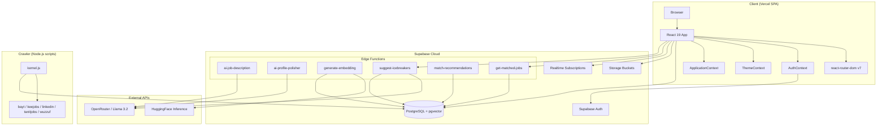
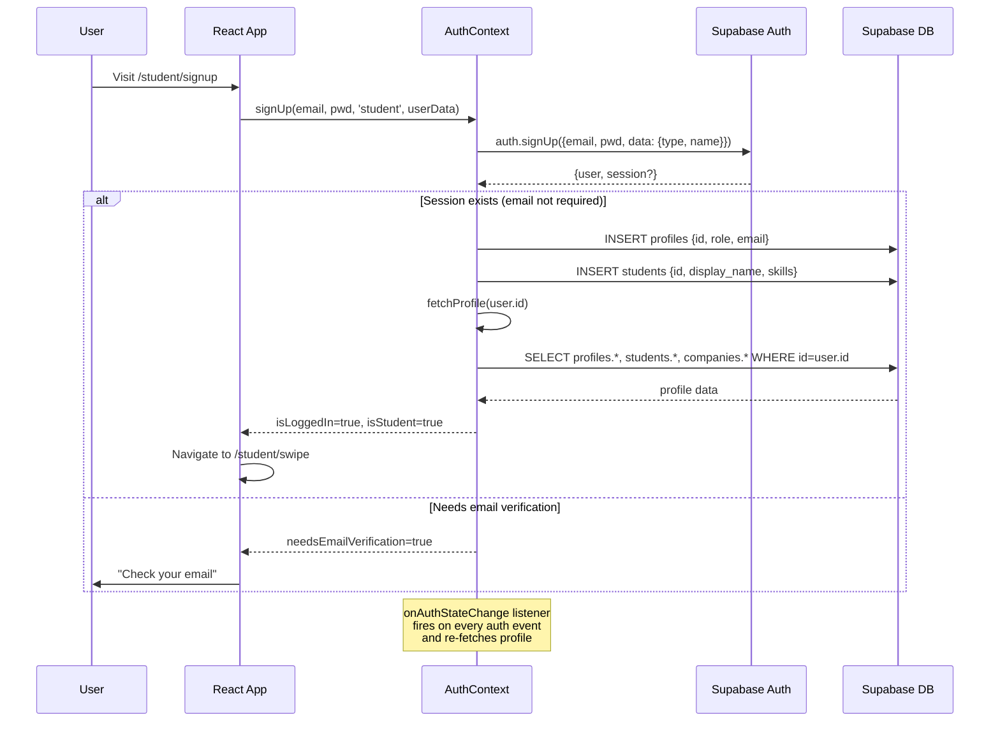
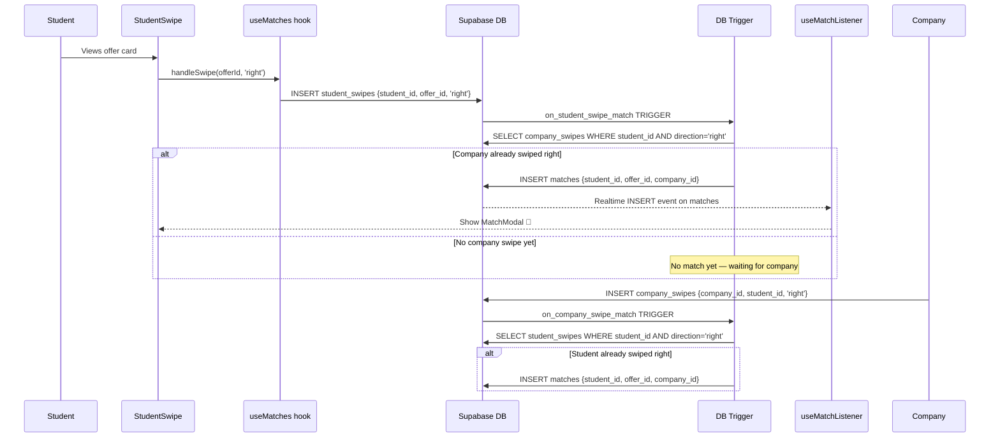
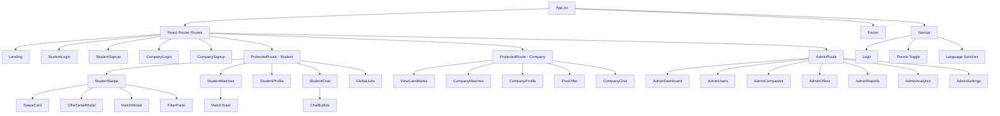
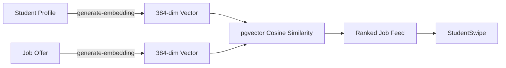

# MatchOp — Complete Architecture Audit & Roadmap

> **Generated:** 2026-02-10  
> **Codebase:** React 19 + Vite 7 + Supabase (NOT Next.js — SPA with client-side routing)  
> **Deploy target:** Vercel (SPA rewrite)

---

## Table of Contents

1. [Architecture Map](#1-architecture-map)
2. [Mermaid Diagrams](#2-mermaid-diagrams)
3. [Complete Bug Registry](#3-complete-bug-registry)
4. [Priority Fixes Roadmap (1–10)](#4-priority-fixes-roadmap)
5. [New Features Roadmap](#5-new-features-roadmap)
6. [Consolidated SQL Script](#6-consolidated-sql-script)
7. [File Changes Index](#7-file-changes-index)
8. [Deployment Checklist](#8-deployment-checklist)

---

## 1. Architecture Map

### Tech Stack

| Layer | Technology | Version |
|-------|-----------|---------|
| **UI Framework** | React (SPA, not Next.js) | 19.2.0 |
| **Build Tool** | Vite | 7.2.4 |
| **Routing** | react-router-dom (lazy-loaded) | 7.11.0 |
| **Backend** | Supabase (Auth + DB + Storage + Edge Functions) | 2.89.0 |
| **Animations** | framer-motion | 12.23.26 |
| **Icons** | lucide-react | 0.561.0 |
| **i18n** | i18next + react-i18next | 23.x / 14.x |
| **PDF Export** | jspdf + html2canvas | 3.0.4 / 1.4.1 |
| **Styling** | Custom CSS (NO Tailwind — ghost classes everywhere) | — |
| **Testing** | Vitest + @testing-library/react + jsdom | 4.0.16 |
| **Hosting** | Vercel (SPA mode) | — |
| **Crawling** | Node.js scripts (axios + cheerio + rss-parser) | — |
| **AI** | 6 Supabase Edge Functions (OpenRouter Llama 3.2 + HuggingFace) | — |

### Provider Hierarchy

```
<StrictMode>
  <BrowserRouter>
    <AuthProvider>          ← Supabase auth + profile state
      <ApplicationProvider> ← localStorage job applications
        <ThemeProvider>     ← light/dark/system via data-theme attribute
          <App />           ← Routes + Navbar + Footer
        </ThemeProvider>
      </ApplicationProvider>
    </AuthProvider>
  </BrowserRouter>
</StrictMode>
```

### Route Map

| Route | Component | Guard | Role |
|-------|-----------|-------|------|
| `/` | Landing | PublicRoute | — |
| `/student/login` | StudentLogin | — | — |
| `/student/signup` | StudentSignup | — | — |
| `/student/profile` | StudentProfile | ProtectedRoute(student) | Student |
| `/student/swipe` | StudentSwipe | ProtectedRoute(student) | Student |
| `/student/matches` | StudentMatches | ProtectedRoute(student) | Student |
| `/student/chat/:matchId` | StudentChat | ProtectedRoute(student) | Student |
| `/student/global-jobs` | GlobalJobs | ProtectedRoute(student) | Student |
| `/company/login` | CompanyLogin | — | — |
| `/company/signup` | CompanySignup | — | — |
| `/company/profile` | CompanyProfile | ProtectedRoute(company) | Company |
| `/company/post-offer` | PostOffer | ProtectedRoute(company) | Company |
| `/company/candidates` | ViewCandidates | ProtectedRoute(company) | Company |
| `/company/matches` | CompanyMatches | ProtectedRoute(company) | Company |
| `/company/chat/:matchId` | CompanyChat | ProtectedRoute(company) | Company |
| `/admin/*` (7 routes) | AdminDashboard etc. | AdminRoute | Admin |
| `/about`, `/blog`, `/contact` | Static pages | — | — |
| `/legal/*` | Terms, Privacy, Cookies | — | — |

### Hooks Map

| Hook | Supabase Tables | Real Data? | Critical Bugs |
|------|----------------|------------|---------------|
| `useJobOffers` | `offers` → `companies` | ✅ Real | Module cache not user-scoped |
| `useMatches` | `matches` → `offers` → `companies`, `student_swipes`, `external_jobs` | ✅ Real | Race condition: 30s timeout vs query; dead constant |
| `useMatchListener` | `matches` (Realtime) | ✅ Real | Student-only; no company realtime |
| `useCandidates` | `offers`, `student_swipes` → `students`, `company_swipes` | ✅ Real | Sequential queries (slow) |
| `useMessages` | `messages` | ⚠️ Partial mock | Silent INSERT failure → fake local msg |
| `useBlocking` | `blocked_users` | ✅ Real | Stale closure on rapid calls |
| `useReporting` | `reported_users` | ✅ Real | No loading state |
| `useStudentProfile` | `students`, `experiences`, `student_education` | ⚠️ Partial | Certs/projects/languages/volunteer LOCAL-ONLY |
| `useExternalJobs` | `external_jobs` | ✅ Real | Double-fetch on mount |
| `useImageUpload` | Storage `avatars`, `students` | ✅ Real | Fake progress bar |
| `useCVUpload` | Storage (via lib) | ✅ Real | No useCallback |
| `useLoadingError` | None (utility) | N/A | — |

### Supabase Schema (V2 — Active)

| Table | Key Columns | FK Relations |
|-------|-------------|-------------|
| `profiles` | `id (UUID→auth.users)`, `role (user_role ENUM)`, `email` | — |
| `students` | `id (UUID→profiles)`, `display_name`, `skills TEXT[]`, `location`, `embedding vector(384)` | → profiles |
| `companies` | `id (UUID→profiles)`, `company_name`, `industry`, `description`, `embedding vector(384)` | → profiles |
| `offers` | `id UUID`, `company_id→companies`, `title`, `req_skills TEXT[]`, `status (offer_status ENUM)`, `embedding vector(384)` | → companies |
| `student_swipes` | `id UUID`, `student_id→students`, `offer_id→offers`, `direction` | → students, offers |
| `company_swipes` | `id UUID`, `company_id→companies`, `student_id→students`, `direction` | → companies, students |
| `matches` | `id UUID`, `student_id`, `offer_id`, `company_id`, `status (match_status ENUM)` | → students, offers, companies |
| `messages` | `id UUID`, `match_id→matches`, `sender_id→profiles`, `content`, `is_read` | → matches, profiles |
| `experiences` | `id UUID`, `student_id→students`, `company_name`, `role`, `start_date`, `end_date` | → students |
| `student_education` | `id UUID`, `student_id→students`, `institution`, `degree`, `field` | → students |
| `external_jobs` | `id UUID`, `title`, `company`, `location`, `url`, `source` | — |
| `blocked_users` | `id UUID`, `blocker_id`, `blocked_id` | → profiles |
| `reported_users` | `id UUID`, `reporter_id`, `reported_id`, `reason` | → profiles |

---

## 2. Mermaid Diagrams

### 2.1 System Architecture



### 2.2 Auth Flow



### 2.3 Swipe & Match Flow



### 2.4 Database ERD

```mermaid
erDiagram
    AUTH_USERS ||--|| PROFILES : "id"
    PROFILES ||--o| STUDENTS : "id"
    PROFILES ||--o| COMPANIES : "id"
    COMPANIES ||--o{ OFFERS : "company_id"
    STUDENTS ||--o{ STUDENT_SWIPES : "student_id"
    OFFERS ||--o{ STUDENT_SWIPES : "offer_id"
    COMPANIES ||--o{ COMPANY_SWIPES : "company_id"
    STUDENTS ||--o{ COMPANY_SWIPES : "student_id"
    STUDENTS ||--o{ MATCHES : "student_id"
    OFFERS ||--o{ MATCHES : "offer_id"
    COMPANIES ||--o{ MATCHES : "company_id"
    MATCHES ||--o{ MESSAGES : "match_id"
    PROFILES ||--o{ MESSAGES : "sender_id"
    STUDENTS ||--o{ EXPERIENCES : "student_id"
    STUDENTS ||--o{ STUDENT_EDUCATION : "student_id"
    PROFILES ||--o{ BLOCKED_USERS : "blocker_id"
    PROFILES ||--o{ REPORTED_USERS : "reporter_id"

    PROFILES {
        uuid id PK
        user_role role
        text email
        timestamp created_at
    }
    STUDENTS {
        uuid id PK_FK
        text display_name
        text location
        text_array skills
        text bio
        vector embedding
    }
    COMPANIES {
        uuid id PK_FK
        text company_name
        text industry
        text description
        vector embedding
    }
    OFFERS {
        uuid id PK
        uuid company_id FK
        text title
        text_array req_skills
        offer_status status
        text salary_range
        vector embedding
    }
    STUDENT_SWIPES {
        uuid id PK
        uuid student_id FK
        uuid offer_id FK
        text direction
    }
    COMPANY_SWIPES {
        uuid id PK
        uuid company_id FK
        uuid student_id FK
        text direction
    }
    MATCHES {
        uuid id PK
        uuid student_id FK
        uuid offer_id FK
        uuid company_id FK
        match_status status
    }
    MESSAGES {
        uuid id PK
        uuid match_id FK
        uuid sender_id FK
        text content
        boolean is_read
    }
```

### 2.5 Component Tree



---

## 3. Complete Bug Registry

### 🔴 CRITICAL — Must Fix Before Deploy

| # | Category | Bug | File(s) | Impact |
|---|----------|-----|---------|--------|
| C1 | **RLS/Auth** | V2 schema enables RLS on `student_swipes`/`company_swipes` but creates **ZERO policies** — all swipes silently blocked | `database/refactor_v2.sql` | **Swipe feature completely broken** |
| C2 | **RLS/Auth** | V2 schema missing INSERT policies on `profiles` and `students` — new user registration fails | `database/refactor_v2.sql` | **Signup broken** |
| C3 | **RLS/Auth** | Multiple "nuclear fix" scripts **DISABLE RLS entirely** on 5+ tables — database wide open | `nuclear_fix.sql`, `fix_rls.sql`, `fix_offers_rls.sql` | **Security: any user can read/write any data** |
| C4 | **RLS/Auth** | Dozens of conflicting/duplicate RLS policies from 15+ fix files | All `database/fix_*.sql` | **Unpredictable access control** |
| C5 | **Mobile** | Auth buttons (Sign Up/Login) **completely hidden** on mobile via `display:none` | `Navbar.css:163` | **Mobile users cannot sign up or log in from nav** |
| C6 | **Mobile** | Ghost Tailwind classes (`mb-4`, `text-primary`, `text-6xl`, `font-bold`, `mr-2`, `text-red-500`, `animate-spin`) used extensively but **Tailwind is NOT installed** — spacing, colors, typography broken | StudentSwipe, StudentLogin, StudentSignup, StudentMatches, SwipeCard | **Silently broken layout everywhere** |
| C7 | **Data** | `useMessages` silently falls back to local/fake message on INSERT failure — user thinks message sent but it's never persisted | `src/hooks/useMessages.js` | **Lost messages** |
| C8 | **Security** | Edge functions `ai-job-description`, `ai-profile-polisher`, `generate-embedding` have **NO auth checks** — anyone can call them | `supabase/functions/` | **API abuse, embedding overwrites** |
| C9 | **Auth** | `PublicRoute` redirect loop when logged-in user has no role (profile not loaded yet) — bounces between `/` and route guards | `RouteGuards.jsx` | **White screen / infinite redirect** |
| C10 | **Data** | `useStudentProfile` — certifications, projects, languages, volunteer work are **local-only state** — lost on page refresh | `src/hooks/useStudentProfile.js` | **User data loss** |

### 🟡 MEDIUM — Fix Before Beta

| # | Category | Bug | File(s) | Impact |
|---|----------|-----|---------|--------|
| M1 | **Auth** | `ProtectedRoute` checks `isStudent`/`isCompany` before profile loads — premature redirect to wrong dashboard | `RouteGuards.jsx` | Confusing UX on slow connections |
| M2 | **Auth** | Company user logging in via student login page → no redirect/warning → guard loop | `StudentLogin.jsx` | Stuck users |
| M3 | **Hook** | `useMatches` 30s timeout race condition — timeout fires, then query completes → stale state | `useMatches.js` | Shows "no data" then flashes results |
| M4 | **Hook** | `useExternalJobs` double-fetch on mount — two identical requests for page 1 | `useExternalJobs.js` | Wasted API calls, potential flicker |
| M5 | **Hook** | `useMatchListener` only subscribes for student matches — companies get no realtime notifications | `useMatchListener.js` | Companies never see new matches live |
| M6 | **Hook** | Module-level caches in `useMatches`/`useJobOffers` not user-scoped — data leaks between user sessions | `useMatches.js`, `useJobOffers.js` | **Cross-user data leak** |
| M7 | **CSS** | `StudentSignup.css` defines `.auth-page` etc. but components use inline `<style>` with `.login-page` — the CSS file is largely dead | `StudentSignup.css`, `StudentLogin.jsx`, `StudentSignup.jsx` | Wasted bytes, maintenance confusion |
| M8 | **CSS** | Password strength bar uses hardcoded hex colors (`#ef4444` etc.) instead of CSS variables — breaks in dark mode | `StudentSignup.jsx` | Dark mode visual break |
| M9 | **UI** | `ApplicationContext` value not memoized — all consumers re-render on every parent render | `ApplicationContext.jsx` | Performance degradation |
| M10 | **UI** | Navbar language dropdown never closes on outside click | `Navbar.jsx` | UX annoyance |
| M11 | **UI** | Swipe "undo" button only reverses UI — DB swipe already committed | `StudentSwipe.jsx` | Misleading feature |
| M12 | **CSS** | Two different mobile breakpoints in navbar (768px vs 901px) — awkward middle zone | `Navbar.css` | Broken layout 768–900px |
| M13 | **Edge Fn** | `match-recommendations` calls RPC `recommend_matches_rpc` that **doesn't exist** in any migration | `supabase/functions/match-recommendations/` | 500 error on call |
| M14 | **UI** | `App.css` is Vite boilerplate — completely dead code | `App.css` | Dead file in bundle |

### 🟢 LOW — Polish Items

| # | Category | Bug | File(s) |
|---|----------|-----|---------|
| L1 | i18n | `'Global Jobs'` label hardcoded English | `Navbar.jsx` |
| L2 | i18n | Landing hero stats hardcoded (`10K+`, `500+`, `5K+`) | `Landing.jsx` |
| L3 | i18n | Landing features section has hardcoded English strings | `Landing.jsx` |
| L4 | CSS | Duplicate `@keyframes fadeIn` definition | `index.css` |
| L5 | CSS | `StudentSignup.css` `.auth-page` padding shorthand overrides padding-top | `StudentSignup.css` |
| L6 | Perf | Non-lazy imports for Navbar, Footer, Logo, LoadingScreen inflate main bundle | `App.jsx` |
| L7 | Perf | SwipeCard: unused Framer Motion spring computations | `SwipeCard.jsx` |
| L8 | UX | SwipeCard click-vs-drag threshold 5px too tight for mobile touch | `SwipeCard.jsx` |
| L9 | UX | `unread_count` in StudentMatches never set — badge never shows | `StudentMatches.jsx` |
| L10 | DX | `useLoadingError` default export is object, not component — inconsistent pattern | `useLoadingError.js` |
| L11 | DX | `hooks/index.js` only exports 3 of 13 hooks | `hooks/index.js` |
| L12 | Theme | `ThemeContext` `appliedTheme` initializes `'light'` causing FOUC if user prefers dark | `ThemeContext.jsx` |
| L13 | Env | Supabase client silently creates with empty strings on missing env vars | `supabase.js` |
| L14 | Mobile | No `env(safe-area-inset-top)` on fixed navbar for notched iPhones | `Navbar.css` |
| L15 | Timer | `ApplicationContext` setTimeout for `recentApplication` never cleaned up | `ApplicationContext.jsx` |

---

## 4. Priority Fixes Roadmap

### Fix 1: Consolidated RLS Policy Reset (Fixes C1, C2, C3, C4)

**Priority:** 🔴 P0 — Nothing works without this  
**Root cause:** V2 schema left swipe tables with RLS enabled but zero policies; subsequent "fix" files disabled RLS entirely.

**SQL Script:** See [Section 6](#6-consolidated-sql-script) for the full `000_canonical_rls.sql`.

---

### Fix 2: Remove Ghost Tailwind Classes (Fixes C6)

**Priority:** 🔴 P0 — Layout silently broken everywhere  
**Root cause:** Code uses `mb-4`, `text-primary`, `font-bold` etc. assuming Tailwind, but **Tailwind is not installed**. These classes are no-ops.

**Approach:** Either (A) install and configure Tailwind, or (B) replace all ghost classes with actual CSS class names from the existing design system in `index.css`.

**Option B is recommended** (less risk, no new dependency). Replace ghost classes with existing CSS equivalents:

| Ghost Class | CSS Replacement |
|-------------|----------------|
| `mb-4` | `style={{ marginBottom: '1rem' }}` or add `.mb-4 { margin-bottom: 1rem; }` to index.css |
| `text-primary` | Already defined in `index.css` → `.text-primary { color: var(--text-primary) }` ← **add this** |
| `text-muted` | Already used → `.text-muted { color: var(--text-muted) }` ← **add this** |
| `font-bold` | `style={{ fontWeight: 700 }}` or `.font-bold { font-weight: 700 }` |
| `text-6xl` | `style={{ fontSize: '3.75rem' }}` or `.text-6xl { font-size: 3.75rem }` |
| `text-2xl` | `.text-2xl { font-size: 1.5rem }` |
| `mr-2` | `.mr-2 { margin-right: 0.5rem }` |
| `ml-2` | `.ml-2 { margin-left: 0.5rem }` |
| `mt-4` | `.mt-4 { margin-top: 1rem }` |
| `mt-2` | `.mt-2 { margin-top: 0.5rem }` |
| `text-sm` | `.text-sm { font-size: 0.875rem }` |
| `animate-spin` | `.animate-spin { animation: spin 1s linear infinite }` |
| `text-red-500` | `.text-red-500 { color: #ef4444 }` |
| `underline` | `.underline { text-decoration: underline }` |

**File: `src/index.css` — Add utility classes block:**

```css
/* ============================================================
   UTILITY CLASSES (replacing ghost Tailwind references)
   ============================================================ */
.text-primary { color: var(--text-primary); }
.text-muted { color: var(--text-muted); }
.text-sm { font-size: 0.875rem; }
.text-2xl { font-size: 1.5rem; line-height: 1.2; }
.text-6xl { font-size: 3.75rem; line-height: 1; }
.font-bold { font-weight: 700; }
.font-semibold { font-weight: 600; }
.mb-2 { margin-bottom: 0.5rem; }
.mb-4 { margin-bottom: 1rem; }
.mb-6 { margin-bottom: 1.5rem; }
.mt-2 { margin-top: 0.5rem; }
.mt-4 { margin-top: 1rem; }
.mr-2 { margin-right: 0.5rem; }
.ml-2 { margin-left: 0.5rem; }
.underline { text-decoration: underline; }
.text-red-500 { color: #ef4444; }
.animate-spin { animation: spin 1s linear infinite; }
@keyframes spin {
  from { transform: rotate(0deg); }
  to { transform: rotate(360deg); }
}
```

---

### Fix 3: Mobile Auth Buttons (Fixes C5)

**Priority:** 🔴 P0 — Mobile users literally cannot sign up

**File: `src/components/Navbar.css`**

Replace the mobile hiding of auth buttons:

```css
/* BEFORE (broken): */
/* @media (max-width: 900px) { .navbar-auth { display: none; } } */

/* AFTER (fixed): */
@media (max-width: 900px) {
    .navbar-auth {
        display: flex;
        gap: 0.5rem;
    }
    .navbar-auth .btn {
        padding: 0.4rem 0.75rem;
        font-size: 0.8rem;
    }
}
```

---

### Fix 4: Route Guard Race Condition (Fixes C9, M1)

**Priority:** 🔴 P1

**File: `src/components/RouteGuards.jsx`**

The `PublicRoute` must handle the case where user is logged in but profile hasn't loaded:

```jsx
// BEFORE:
export function PublicRoute({ children }) {
    const { isLoggedIn, isLoading, isStudent, isCompany } = useAuth()
    if (isLoading) return <AuthLoadingSpinner />
    if (isLoggedIn) {
        if (isStudent) return <Navigate to="/student/swipe" replace />
        if (isCompany) return <Navigate to="/company/candidates" replace />
        return <Navigate to="/" replace />  // ← LOOP!
    }
    return children
}

// AFTER:
export function PublicRoute({ children }) {
    const { isLoggedIn, isLoading, isStudent, isCompany, profile } = useAuth()
    if (isLoading) return <AuthLoadingSpinner />
    if (isLoggedIn) {
        // Wait for profile to load before redirecting
        if (!profile) return <AuthLoadingSpinner />
        if (isStudent) return <Navigate to="/student/swipe" replace />
        if (isCompany) return <Navigate to="/company/candidates" replace />
        // Unknown role — don't redirect to "/" (would loop), show landing content
        return children
    }
    return children
}
```

Similarly fix `ProtectedRoute` to wait for profile:

```jsx
export function ProtectedRoute({ children, requiredType = null }) {
    const { isLoggedIn, isLoading, isStudent, isCompany, user, profile } = useAuth()
    const location = useLocation()

    if (isLoading) return <AuthLoadingSpinner />
    if (!isLoggedIn || !user) {
        const isCompanyPath = location.pathname.startsWith('/company')
        return <Navigate to={isCompanyPath ? '/company/login' : '/student/login'} 
               state={{ from: location }} replace />
    }
    // Wait for profile before role-checking
    if (requiredType && !profile) return <AuthLoadingSpinner />
    if (requiredType === 'student' && !isStudent)
        return <Navigate to="/company/candidates" replace />
    if (requiredType === 'company' && !isCompany)
        return <Navigate to="/student/swipe" replace />
    return children
}
```

---

### Fix 5: useMessages Silent Failure (Fixes C7)

**Priority:** 🔴 P1

**File: `src/hooks/useMessages.js`**

Remove the fake local message fallback on INSERT failure:

```js
// BEFORE:
const sendMessage = async (content) => {
    // ...INSERT attempt...
    if (error) {
        // For demo — add local message
        const localMsg = { id: Date.now(), content, sender_id: user.id, ... }
        setMessages(prev => [...prev, localMsg])
        return true  // ← LIES
    }
}

// AFTER:
const sendMessage = async (content) => {
    if (!user || !matchId) return false
    const { data, error } = await supabase.from('messages').insert({
        match_id: matchId,
        sender_id: user.id,
        content: content.trim()
    }).select()
    
    if (error) {
        console.error('[useMessages] Failed to send:', error)
        return false  // ← TRUTH
    }
    // Don't add locally — Realtime subscription will pick it up
    return true
}
```

---

### Fix 6: useMatches Race Condition (Fixes M3)

**Priority:** 🟡 P2

**File: `src/hooks/useMatches.js`**

Use an AbortController pattern instead of a competing timeout:

```js
// Replace the timeout + query pattern with:
const fetchOffers = useCallback(async () => {
    if (!user) return
    const controller = new AbortController()
    setLoading(true)
    setError(null)
    
    try {
        const { data, error } = await supabase
            .from('offers')
            .select('*, companies(*)')
            .eq('status', 'active')
            .abortSignal(controller.signal)
        
        if (error) throw error
        setOffers(data || [])
    } catch (err) {
        if (err.name !== 'AbortError') {
            setError(err.message)
        }
    } finally {
        setLoading(false)
    }
    
    return () => controller.abort()
}, [user])
```

---

### Fix 7: Mobile Navbar Safe Areas (Fixes L14, C5)

**Priority:** 🟡 P2

**File: `src/components/Navbar.css`**

```css
.navbar {
    /* Add safe area support for notched iPhones */
    padding-top: env(safe-area-inset-top, 0);
    padding-left: env(safe-area-inset-left, 0);
    padding-right: env(safe-area-inset-right, 0);
}
```

**File: `src/App.jsx`** — Fix the hardcoded padding-top:

```jsx
// BEFORE:
<main style={{ paddingTop: '90px' }}>

// AFTER:
<main className="app-main">

// In index.css:
.app-main {
    padding-top: 90px;
}
@media (max-width: 768px) {
    .app-main {
        padding-top: 70px; /* mobile navbar height */
    }
}
```

---

### Fix 8: Edge Function Auth (Fixes C8)

**Priority:** 🟡 P2

Add auth checks to unprotected edge functions. Example for `ai-job-description`:

```typescript
// Add at the top of the handler:
const authHeader = req.headers.get('Authorization')
if (!authHeader) {
    return new Response(JSON.stringify({ error: 'Authorization required' }), {
        status: 401, headers: { ...corsHeaders, 'Content-Type': 'application/json' }
    })
}
const supabaseClient = createClient(
    Deno.env.get('SUPABASE_URL')!,
    Deno.env.get('SUPABASE_ANON_KEY')!,
    { global: { headers: { Authorization: authHeader } } }
)
const { data: { user }, error } = await supabaseClient.auth.getUser()
if (error || !user) {
    return new Response(JSON.stringify({ error: 'Invalid token' }), {
        status: 401, headers: { ...corsHeaders, 'Content-Type': 'application/json' }
    })
}
```

Apply the same pattern to `ai-profile-polisher` and `generate-embedding`.

---

### Fix 9: ApplicationContext Memoization (Fixes M9, L15)

**Priority:** 🟢 P3

**File: `src/context/ApplicationContext.jsx`**

```jsx
import { createContext, useContext, useState, useEffect, useCallback, useMemo, useRef } from 'react'

// Wrap functions in useCallback, value in useMemo:
const addApplication = useCallback((company, userProfile) => {
    // ...existing logic...
    const timerId = setTimeout(() => setRecentApplication(null), 3000)
    timerRef.current = timerId
    return newApplication
}, [])

// Cleanup timer on unmount:
const timerRef = useRef(null)
useEffect(() => () => clearTimeout(timerRef.current), [])

const value = useMemo(() => ({
    applications, recentApplication, addApplication,
    hasAppliedTo, getApplications, updateApplicationStatus,
}), [applications, recentApplication, addApplication, hasAppliedTo, getApplications, updateApplicationStatus])
```

---

### Fix 10: Module Cache User Scoping (Fixes M6)

**Priority:** 🟢 P3

**Files: `src/hooks/useMatches.js`, `src/hooks/useJobOffers.js`**

Include user ID in cache keys:

```js
// BEFORE:
const cache = { data: null, timestamp: 0, type: null }

// AFTER:
const cacheMap = new Map()  // userId → { data, timestamp, type }

function getCache(userId) {
    return cacheMap.get(userId) || { data: null, timestamp: 0, type: null }
}
function setCache(userId, data, type) {
    cacheMap.set(userId, { data, timestamp: Date.now(), type })
}
// Clear on logout:
function clearCache(userId) {
    cacheMap.delete(userId)
}
```

---

## 5. New Features Roadmap

### Phase 1: AI-Powered Matching (Weeks 1–3)



**What exists:** `generate-embedding`, `get-matched-jobs`, `match_jobs_for_student` RPC, pgvector migration.  
**What's missing:**
1. **Create `recommend_matches_rpc`** — the function referenced by `match-recommendations` edge function:

```sql
CREATE OR REPLACE FUNCTION recommend_matches_rpc(
    p_student_id UUID,
    p_limit INT DEFAULT 20,
    p_max_distance_km FLOAT DEFAULT 100
)
RETURNS TABLE (
    offer_id UUID,
    company_name TEXT,
    title TEXT,
    match_score FLOAT,
    distance_km FLOAT
) AS $$
BEGIN
    RETURN QUERY
    SELECT 
        o.id as offer_id,
        c.company_name,
        o.title,
        (1 - (s.embedding <=> o.embedding)) * 0.6 +
        CASE WHEN s.location_point IS NOT NULL AND o.location_point IS NOT NULL
             THEN GREATEST(0, 1 - ST_Distance(s.location_point, o.location_point) / (p_max_distance_km * 1000)) * 0.3
             ELSE 0.15 END +
        (1.0 / (1 + EXTRACT(EPOCH FROM NOW() - o.created_at) / 86400)) * 0.1
        as match_score,
        CASE WHEN s.location_point IS NOT NULL AND o.location_point IS NOT NULL
             THEN ST_Distance(s.location_point, o.location_point) / 1000
             ELSE NULL END as distance_km
    FROM offers o
    JOIN companies c ON o.company_id = c.id
    CROSS JOIN students s
    WHERE s.id = p_student_id
      AND o.status = 'active'
      AND o.embedding IS NOT NULL
      AND s.embedding IS NOT NULL
      AND o.id NOT IN (SELECT sw.offer_id FROM student_swipes sw WHERE sw.student_id = p_student_id)
    ORDER BY match_score DESC
    LIMIT p_limit;
END;
$$ LANGUAGE plpgsql SECURITY DEFINER;

GRANT EXECUTE ON FUNCTION recommend_matches_rpc TO authenticated;
```

2. **Auto-generate embeddings on profile/offer save** — trigger or webhook
3. **Preference weights in student profile** (remote_ok, salary_min, contract_type)
4. **"Why this match?" explainability** — show skill overlap percentage in SwipeCard

---

### Phase 2: Real-Time Chat & Notifications (Weeks 3–5)

**What exists:** `useMessages` hook, `StudentChat`/`CompanyChat` pages, `ChatBubble` component, Supabase Realtime subscription.  
**What's missing:**

1. **Fix `useMessages` to not fake messages** (Fix #5 above)
2. **Unread message count** — add to matches query:

```sql
-- Add to the matches select:
SELECT m.*, 
    (SELECT COUNT(*) FROM messages msg 
     WHERE msg.match_id = m.id 
       AND msg.sender_id != auth.uid() 
       AND msg.is_read = false) as unread_count
FROM matches m
```

3. **Push notifications** via Supabase Edge Function + Web Push API:
   - New edge function: `send-push-notification`
   - Browser `Notification.requestPermission()` on first match
   - Service worker for background notifications

4. **Typing indicators** via Supabase Realtime presence:

```js
const channel = supabase.channel(`chat:${matchId}`)
channel.on('presence', { event: 'sync' }, () => {
    const state = channel.presenceState()
    setIsTyping(Object.values(state).some(p => p[0]?.typing))
})
// On input change:
channel.track({ typing: true })
```

5. **Read receipts** — update `is_read` when message enters viewport (IntersectionObserver)

---

### Phase 3: Enhanced Profiles (Weeks 5–7)

1. **Video introductions:**
   - New Supabase Storage bucket: `profile-videos`
   - Max 60s, 50MB limit
   - Thumbnail generation via edge function
   - `students.video_url` column

2. **Skill endorsements:**

```sql
CREATE TABLE endorsements (
    id UUID DEFAULT gen_random_uuid() PRIMARY KEY,
    endorser_id UUID REFERENCES profiles(id),
    student_id UUID REFERENCES students(id),
    skill TEXT NOT NULL,
    created_at TIMESTAMPTZ DEFAULT now(),
    UNIQUE(endorser_id, student_id, skill)
);
```

3. **Portfolio gallery** — carousel component for projects with images
4. **LinkedIn import** — parse LinkedIn PDF export for auto-fill
5. **Verification badges** (already partially built: `VerificationBadge.jsx`, `verification.js`)

---

### Phase 4: Company Dashboards (Weeks 7–9)

1. **Analytics dashboard:**
   - Views per offer (track in `offer_views` table)
   - Swipe-right rate per offer
   - Time-to-match metrics
   - Candidate funnel visualization (Chart.js or Recharts)

2. **Offer templates:**
   - Save/load offer configurations
   - AI-assisted job description (already built: `ai-job-description`)

3. **Team accounts:**
   - `company_members` table with roles (admin, recruiter, viewer)
   - Invite system via email

4. **Applicant Tracking System (ATS) lite:**
   - Pipeline stages: Applied → Screening → Interview → Offer → Hired
   - Drag-and-drop Kanban board
   - Interview scheduling (see `smartScheduling.js` — already exists)

---

### Phase 5: Gamification & Engagement (Weeks 9–12)

1. **Daily swipe streaks:**

```sql
CREATE TABLE user_streaks (
    user_id UUID PRIMARY KEY REFERENCES profiles(id),
    current_streak INT DEFAULT 0,
    longest_streak INT DEFAULT 0,
    last_active_date DATE,
    total_swipes INT DEFAULT 0,
    xp_points INT DEFAULT 0
);

CREATE OR REPLACE FUNCTION update_streak()
RETURNS TRIGGER AS $$
BEGIN
    INSERT INTO user_streaks (user_id, current_streak, longest_streak, last_active_date, total_swipes)
    VALUES (NEW.student_id, 1, 1, CURRENT_DATE, 1)
    ON CONFLICT (user_id) DO UPDATE SET
        current_streak = CASE 
            WHEN user_streaks.last_active_date = CURRENT_DATE - 1 
            THEN user_streaks.current_streak + 1
            WHEN user_streaks.last_active_date = CURRENT_DATE 
            THEN user_streaks.current_streak
            ELSE 1 END,
        longest_streak = GREATEST(user_streaks.longest_streak, 
            CASE WHEN user_streaks.last_active_date = CURRENT_DATE - 1 
            THEN user_streaks.current_streak + 1 ELSE 1 END),
        last_active_date = CURRENT_DATE,
        total_swipes = user_streaks.total_swipes + 1,
        xp_points = user_streaks.xp_points + 10;
    RETURN NEW;
END;
$$ LANGUAGE plpgsql SECURITY DEFINER;

CREATE TRIGGER track_swipe_streak
    AFTER INSERT ON student_swipes
    FOR EACH ROW EXECUTE FUNCTION update_streak();
```

2. **Achievements/badges:**
   - "First Match 🎉", "5 Matches 🔥", "Profile Complete ✅", "10-Day Streak 🏆"
   - Toast notifications on unlock
   - Profile badge showcase

3. **Leaderboard** (opt-in):
   - Top matches by week
   - Most active students
   - XP rankings

4. **Super Swipe** — limited daily "super likes" that notify the company immediately

5. **Profile boost** — temporary ranking boost (earned via streaks or premium)

---

## 6. Consolidated SQL Script

```sql
-- ============================================================
-- 000_canonical_rls.sql
-- SINGLE AUTHORITATIVE RLS POLICY FILE
-- Run this ONCE to fix all policy conflicts
-- ============================================================

-- 1. RE-ENABLE RLS ON ALL TABLES (undo nuclear fixes)
ALTER TABLE profiles ENABLE ROW LEVEL SECURITY;
ALTER TABLE students ENABLE ROW LEVEL SECURITY;
ALTER TABLE companies ENABLE ROW LEVEL SECURITY;
ALTER TABLE offers ENABLE ROW LEVEL SECURITY;
ALTER TABLE student_swipes ENABLE ROW LEVEL SECURITY;
ALTER TABLE company_swipes ENABLE ROW LEVEL SECURITY;
ALTER TABLE matches ENABLE ROW LEVEL SECURITY;
ALTER TABLE messages ENABLE ROW LEVEL SECURITY;

-- Also handle optional tables (may not exist)
DO $$ BEGIN
    EXECUTE 'ALTER TABLE IF EXISTS experiences ENABLE ROW LEVEL SECURITY';
    EXECUTE 'ALTER TABLE IF EXISTS student_education ENABLE ROW LEVEL SECURITY';
    EXECUTE 'ALTER TABLE IF EXISTS external_jobs ENABLE ROW LEVEL SECURITY';
    EXECUTE 'ALTER TABLE IF EXISTS blocked_users ENABLE ROW LEVEL SECURITY';
    EXECUTE 'ALTER TABLE IF EXISTS reported_users ENABLE ROW LEVEL SECURITY';
EXCEPTION WHEN OTHERS THEN NULL;
END $$;

-- 2. DROP ALL EXISTING POLICIES (nuclear cleanup)
DO $$ 
DECLARE
    r RECORD;
BEGIN
    FOR r IN (
        SELECT schemaname, tablename, policyname 
        FROM pg_policies 
        WHERE schemaname = 'public'
    ) LOOP
        EXECUTE format('DROP POLICY IF EXISTS %I ON %I.%I', 
                       r.policyname, r.schemaname, r.tablename);
    END LOOP;
END $$;

-- 3. REVOKE DANGEROUS GRANTS
REVOKE ALL ON TABLE profiles FROM anon;
REVOKE ALL ON TABLE students FROM anon;
REVOKE ALL ON TABLE companies FROM anon;
REVOKE ALL ON TABLE offers FROM anon;
REVOKE ALL ON TABLE student_swipes FROM anon;
REVOKE ALL ON TABLE company_swipes FROM anon;
REVOKE ALL ON TABLE matches FROM anon;
REVOKE ALL ON TABLE messages FROM anon;

-- Re-grant proper access
GRANT SELECT, INSERT, UPDATE ON TABLE profiles TO authenticated;
GRANT SELECT, INSERT, UPDATE ON TABLE students TO authenticated;
GRANT SELECT, INSERT, UPDATE ON TABLE companies TO authenticated;
GRANT SELECT ON TABLE offers TO authenticated;
GRANT INSERT, UPDATE, DELETE ON TABLE offers TO authenticated;
GRANT SELECT, INSERT ON TABLE student_swipes TO authenticated;
GRANT SELECT, INSERT ON TABLE company_swipes TO authenticated;
GRANT SELECT ON TABLE matches TO authenticated;
GRANT SELECT, INSERT, UPDATE ON TABLE messages TO authenticated;

-- ============================================================
-- 4. CREATE CANONICAL POLICIES
-- ============================================================

-- ---- PROFILES ----
CREATE POLICY "profiles_select" ON profiles FOR SELECT
    TO authenticated USING (true);  -- all authenticated users can see profiles

CREATE POLICY "profiles_insert_own" ON profiles FOR INSERT
    TO authenticated WITH CHECK (auth.uid() = id);

CREATE POLICY "profiles_update_own" ON profiles FOR UPDATE
    TO authenticated USING (auth.uid() = id) WITH CHECK (auth.uid() = id);

-- ---- STUDENTS ----
CREATE POLICY "students_select" ON students FOR SELECT
    TO authenticated USING (true);  -- companies need to see student profiles

CREATE POLICY "students_insert_own" ON students FOR INSERT
    TO authenticated WITH CHECK (auth.uid() = id);

CREATE POLICY "students_update_own" ON students FOR UPDATE
    TO authenticated USING (auth.uid() = id) WITH CHECK (auth.uid() = id);

-- ---- COMPANIES ----
CREATE POLICY "companies_select" ON companies FOR SELECT
    TO authenticated USING (true);  -- students need to see company info

CREATE POLICY "companies_insert_own" ON companies FOR INSERT
    TO authenticated WITH CHECK (auth.uid() = id);

CREATE POLICY "companies_update_own" ON companies FOR UPDATE
    TO authenticated USING (auth.uid() = id) WITH CHECK (auth.uid() = id);

-- ---- OFFERS ----
CREATE POLICY "offers_select_active" ON offers FOR SELECT
    TO authenticated USING (status = 'active' OR company_id = auth.uid());

CREATE POLICY "offers_insert_company" ON offers FOR INSERT
    TO authenticated WITH CHECK (company_id = auth.uid());

CREATE POLICY "offers_update_company" ON offers FOR UPDATE
    TO authenticated USING (company_id = auth.uid()) WITH CHECK (company_id = auth.uid());

CREATE POLICY "offers_delete_company" ON offers FOR DELETE
    TO authenticated USING (company_id = auth.uid());

-- ---- STUDENT SWIPES ----
CREATE POLICY "student_swipes_select_own" ON student_swipes FOR SELECT
    TO authenticated USING (student_id = auth.uid());

CREATE POLICY "student_swipes_insert_own" ON student_swipes FOR INSERT
    TO authenticated WITH CHECK (student_id = auth.uid());

-- ---- COMPANY SWIPES ----
CREATE POLICY "company_swipes_select_own" ON company_swipes FOR SELECT
    TO authenticated USING (company_id = auth.uid());

CREATE POLICY "company_swipes_insert_own" ON company_swipes FOR INSERT
    TO authenticated WITH CHECK (company_id = auth.uid());

-- ---- MATCHES ----
CREATE POLICY "matches_select_participant" ON matches FOR SELECT
    TO authenticated USING (
        student_id = auth.uid() OR company_id = auth.uid()
    );

-- Matches are created by triggers, not directly by users
-- But the trigger runs as SECURITY DEFINER, so no INSERT policy needed
-- If direct insert is needed:
CREATE POLICY "matches_insert_trigger" ON matches FOR INSERT
    TO authenticated WITH CHECK (
        student_id = auth.uid() OR company_id = auth.uid()
    );

CREATE POLICY "matches_update_participant" ON matches FOR UPDATE
    TO authenticated USING (
        student_id = auth.uid() OR company_id = auth.uid()
    );

-- ---- MESSAGES ----
CREATE POLICY "messages_select_match_member" ON messages FOR SELECT
    TO authenticated USING (
        match_id IN (
            SELECT id FROM matches 
            WHERE student_id = auth.uid() OR company_id = auth.uid()
        )
    );

CREATE POLICY "messages_insert_match_member" ON messages FOR INSERT
    TO authenticated WITH CHECK (
        sender_id = auth.uid() AND
        match_id IN (
            SELECT id FROM matches 
            WHERE student_id = auth.uid() OR company_id = auth.uid()
        )
    );

CREATE POLICY "messages_update_own" ON messages FOR UPDATE
    TO authenticated USING (
        match_id IN (
            SELECT id FROM matches 
            WHERE student_id = auth.uid() OR company_id = auth.uid()
        )
    );

-- ---- EXPERIENCES ----
DO $$ BEGIN
    CREATE POLICY "experiences_select" ON experiences FOR SELECT
        TO authenticated USING (true);
    CREATE POLICY "experiences_insert_own" ON experiences FOR INSERT
        TO authenticated WITH CHECK (student_id = auth.uid());
    CREATE POLICY "experiences_update_own" ON experiences FOR UPDATE
        TO authenticated USING (student_id = auth.uid());
    CREATE POLICY "experiences_delete_own" ON experiences FOR DELETE
        TO authenticated USING (student_id = auth.uid());
EXCEPTION WHEN undefined_table THEN NULL;
END $$;

-- ---- STUDENT EDUCATION ----
DO $$ BEGIN
    CREATE POLICY "education_select" ON student_education FOR SELECT
        TO authenticated USING (true);
    CREATE POLICY "education_insert_own" ON student_education FOR INSERT
        TO authenticated WITH CHECK (student_id = auth.uid());
    CREATE POLICY "education_update_own" ON student_education FOR UPDATE
        TO authenticated USING (student_id = auth.uid());
    CREATE POLICY "education_delete_own" ON student_education FOR DELETE
        TO authenticated USING (student_id = auth.uid());
EXCEPTION WHEN undefined_table THEN NULL;
END $$;

-- ---- EXTERNAL JOBS (public read) ----
DO $$ BEGIN
    CREATE POLICY "external_jobs_select" ON external_jobs FOR SELECT
        TO authenticated USING (true);
    CREATE POLICY "external_jobs_select_anon" ON external_jobs FOR SELECT
        TO anon USING (true);
EXCEPTION WHEN undefined_table THEN NULL;
END $$;

-- ---- BLOCKED USERS ----
DO $$ BEGIN
    CREATE POLICY "blocked_select_own" ON blocked_users FOR SELECT
        TO authenticated USING (blocker_id = auth.uid());
    CREATE POLICY "blocked_insert_own" ON blocked_users FOR INSERT
        TO authenticated WITH CHECK (blocker_id = auth.uid());
    CREATE POLICY "blocked_delete_own" ON blocked_users FOR DELETE
        TO authenticated USING (blocker_id = auth.uid());
EXCEPTION WHEN undefined_table THEN NULL;
END $$;

-- ---- REPORTED USERS ----
DO $$ BEGIN
    CREATE POLICY "reported_select_own" ON reported_users FOR SELECT
        TO authenticated USING (reporter_id = auth.uid());
    CREATE POLICY "reported_insert_own" ON reported_users FOR INSERT
        TO authenticated WITH CHECK (reporter_id = auth.uid());
EXCEPTION WHEN undefined_table THEN NULL;
END $$;

-- ============================================================
-- 5. STORAGE POLICIES
-- ============================================================
DO $$ BEGIN
    -- Avatars bucket
    INSERT INTO storage.buckets (id, name, public) 
    VALUES ('avatars', 'avatars', true) ON CONFLICT DO NOTHING;
    
    DELETE FROM storage.policies WHERE bucket_id = 'avatars';
    
    -- Anyone can view avatars (public bucket)
    INSERT INTO storage.policies (name, bucket_id, operation, definition)
    VALUES ('avatars_select', 'avatars', 'SELECT', 'true');
    
    -- Users can upload to their own folder
    INSERT INTO storage.policies (name, bucket_id, operation, definition)
    VALUES ('avatars_insert', 'avatars', 'INSERT', 
            '(auth.uid())::text = (storage.foldername(name))[1]');
    
    INSERT INTO storage.policies (name, bucket_id, operation, definition)
    VALUES ('avatars_update', 'avatars', 'UPDATE', 
            '(auth.uid())::text = (storage.foldername(name))[1]');
    
    INSERT INTO storage.policies (name, bucket_id, operation, definition)
    VALUES ('avatars_delete', 'avatars', 'DELETE', 
            '(auth.uid())::text = (storage.foldername(name))[1]');

EXCEPTION WHEN OTHERS THEN 
    RAISE NOTICE 'Storage policy setup skipped: %', SQLERRM;
END $$;

-- ============================================================
-- 6. VERIFY
-- ============================================================
SELECT tablename, policyname, cmd, roles
FROM pg_policies 
WHERE schemaname = 'public'
ORDER BY tablename, cmd;
```

---

## 7. File Changes Index

### Summary of All Files Requiring Changes

| Priority | File | Change Type | Bug(s) Fixed |
|----------|------|-------------|-------------|
| P0 | `database/000_canonical_rls.sql` | **NEW FILE** | C1, C2, C3, C4 |
| P0 | `src/index.css` | **ADD** utility classes block | C6 |
| P0 | `src/components/Navbar.css` | **EDIT** mobile auth visibility + safe areas | C5, L14 |
| P1 | `src/components/RouteGuards.jsx` | **EDIT** PublicRoute + ProtectedRoute | C9, M1 |
| P1 | `src/hooks/useMessages.js` | **EDIT** remove fake local message | C7 |
| P2 | `src/hooks/useMatches.js` | **EDIT** fix race condition + user-scoped cache | M3, M6 |
| P2 | `src/hooks/useExternalJobs.js` | **EDIT** fix double-fetch | M4 |
| P2 | `src/hooks/useMatchListener.js` | **EDIT** support company matches | M5 |
| P2 | `supabase/functions/ai-job-description/index.ts` | **EDIT** add auth | C8 |
| P2 | `supabase/functions/ai-profile-polisher/index.ts` | **EDIT** add auth | C8 |
| P2 | `supabase/functions/generate-embedding/index.ts` | **EDIT** add auth | C8 |
| P3 | `src/context/ApplicationContext.jsx` | **EDIT** memoize | M9, L15 |
| P3 | `src/hooks/useJobOffers.js` | **EDIT** user-scoped cache | M6 |
| P3 | `src/context/ThemeContext.jsx` | **EDIT** fix FOUC | L12 |
| P3 | `src/components/Navbar.jsx` | **EDIT** outside-click handler | M10 |
| P3 | `src/App.css` | **DELETE** (dead Vite boilerplate) | M14 |
| P3 | `src/hooks/useStudentProfile.js` | **EDIT** persist local-only sections | C10 |

### New Files for Features

| Phase | File | Purpose |
|-------|------|---------|
| 1 | `database/001_recommend_matches_rpc.sql` | Missing RPC function |
| 1 | `src/hooks/useAIMatching.js` | Hook for AI-ranked feed |
| 2 | `src/hooks/useTypingIndicator.js` | Realtime typing presence |
| 2 | `src/hooks/useUnreadCount.js` | Unread message badges |
| 3 | `database/002_endorsements.sql` | Endorsements table |
| 3 | `src/hooks/useEndorsements.js` | Endorsement CRUD |
| 4 | `database/003_offer_analytics.sql` | Analytics tables |
| 4 | `src/pages/company/CompanyAnalytics.jsx` | Analytics dashboard |
| 5 | `database/004_gamification.sql` | Streaks + achievements |
| 5 | `src/hooks/useStreaks.js` | Streak tracking |
| 5 | `src/components/AchievementToast.jsx` | Achievement unlock toast |

---

## 8. Deployment Checklist

### Pre-Deploy

- [ ] Run `000_canonical_rls.sql` on Supabase SQL Editor
- [ ] Verify all RLS policies: `SELECT * FROM pg_policies WHERE schemaname = 'public'`
- [ ] Set Vercel env vars: `VITE_SUPABASE_URL`, `VITE_SUPABASE_ANON_KEY`
- [ ] Set Supabase secrets: `OPENROUTER_API_KEY`, `HF_API_KEY`
- [ ] Test signup flow (student + company) on staging
- [ ] Test swipe → match trigger on staging
- [ ] Test message send/receive on staging
- [ ] Verify mobile layout on iPhone Safari + Android Chrome

### Deploy

```bash
# Build locally first
npm run build

# Run tests
npm run test:run

# Deploy to Vercel
vercel --prod
```

### Post-Deploy

- [ ] Verify SPA routing (deep links like `/student/swipe` should not 404)
- [ ] Check Supabase Edge Functions are deployed: `supabase functions list`
- [ ] Monitor Supabase logs for RLS violations
- [ ] Run Lighthouse audit: `npx lighthouse https://matchop.vercel.app --view`
- [ ] Test on real mobile devices (not just DevTools)

### Vercel Configuration

`vercel.json` is already correct:
```json
{
    "rewrites": [{ "source": "/(.*)", "destination": "/" }]
}
```

This ensures all routes are handled by the SPA.

---

## Appendix: Key Observations

### Why This Is NOT Next.js

Despite the user's mention of "Next.js", this project is a **pure React SPA** built with **Vite**:
- No `next.config.js`, no `pages/` directory in Next.js convention
- Uses `react-router-dom` for client-side routing
- Uses `vite.config.js` with `@vitejs/plugin-react`
- Deploys as static files to Vercel with SPA rewrite
- No SSR, no API routes, no `getServerSideProps`

### The "15 Fix Files" Pattern

The database directory contains **15 "fix" files** (`fix_*.sql`, `DEFINITIVE_FIX.sql`, `nuclear_fix.sql`, etc.) that represent an escalating series of attempts to fix RLS permissions. The pattern was:

1. V2 schema created with incomplete policies
2. Signup started failing → `fix_rls.sql` (added INSERT on profiles)
3. Swipes started failing → `fix_swipes_rls.sql` (added swipe policies)
4. Offers not visible → `fix_offers_rls.sql` (**disabled RLS on offers/companies**)
5. Still broken → `nuclear_fix.sql` (**disabled RLS on 5 tables**)
6. Still broken → `DEFINITIVE_FIX.sql` (**disabled RLS on matches**)

The correct fix is `000_canonical_rls.sql` (Section 6), which re-enables RLS everywhere and creates one coherent policy set.

### CSS Architecture Decision

The project uses a **custom CSS design system** with CSS custom properties, NOT Tailwind. However, many JSX files contain Tailwind-style utility classes (`mb-4`, `text-primary`, `font-bold`) that are **non-functional**. This suggests either:
- A developer accustomed to Tailwind wrote JSX but forgot to install it
- Tailwind was planned but never configured
- Classes were copied from a Tailwind reference project

The fix (Section 4, Fix 2) adds the minimal utility classes to `index.css` rather than installing Tailwind, to avoid cascading style conflicts.
