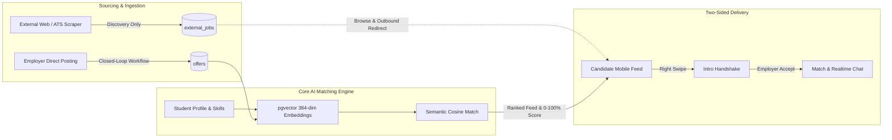
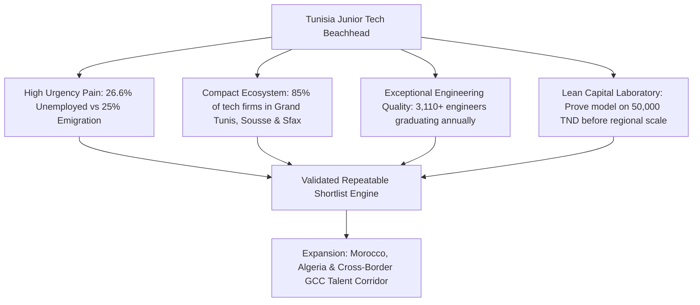
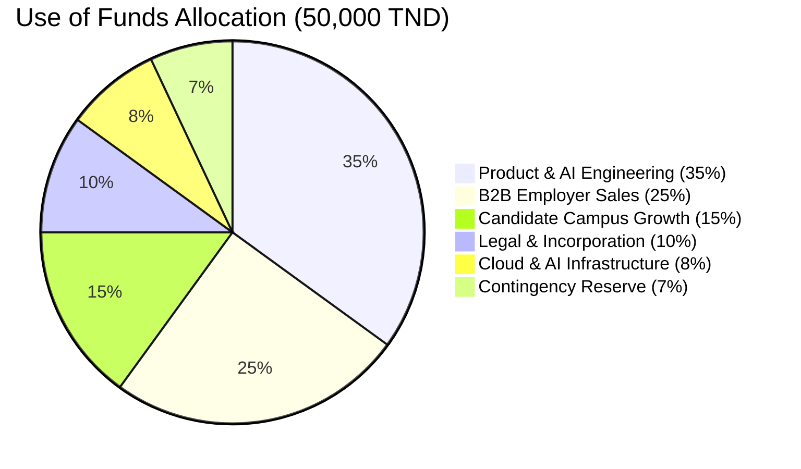

# MATCHOP: STRATEGIC VENTURE MEMORANDUM & DEFINITIVE INVESTOR REPORT

```
====================================================================================================
CONFIDENTIAL | PRE-SEED INVESTMENT & INSTITUTIONAL VALIDATION DOSSIER
PROJECT NAME: MatchOp ("Match the Opportunity")
HEADQUARTERS: Mahdia, Republic of Tunisia
OFFICIAL PORTAL: https://matchop.vercel.app
DOCUMENT VERSION: 2.0 — Post-Audit Edition (September 2026)
ANALYTICAL STANDARD: Strict Empirical Fact-versus-Assumption Discipline
TARGET ROUND: Pre-Seed Commercial Validation Tranche (50,000 TND / ~$16,200 USD)
LEAD CONTACT: Founding Leadership Team (Contact: matchop@gmail.com / fatnassizied@fsegma.u-monastir.tn)
====================================================================================================
```

---

## METHODOLOGICAL LEGEND & FACT-DISCIPLINE TAXONOMY

To guarantee absolute institutional credibility and align with venture capital investment standards, every assertion, data point, and projection within this report is tagged with its empirical status:

* `[VERIFIED CURRENT FACT]`: Ground-truth operational or codebase metrics verified from repository source files or direct management confirmation.
* `[CURRENT PRODUCT CAPABILITY]`: Code-level functionality currently implemented in the frontend, backend, database schema, or edge functions.
* `[MANAGEMENT INPUT]`: Information provided directly by MatchOp leadership regarding corporate status, team, and operational plans.
* `[MARKET DATA]`: Verified statistics sourced from national statistical agencies (INS, HCP, CAPMAS, GASTAT) or multilateral institutions (World Bank, ILO).
* `[ASSUMPTION]`: Unvalidated commercial, behavioral, or market hypotheses requiring testing.
* `[FORECAST]`: Mathematically modeled forward-looking projections based on stated assumptions.
* `[STRATEGIC RECOMMENDATION]`: Evidence-based directives designed to optimize marketplace liquidity, unit economics, and venture survival.
* `[FUTURE ROADMAP]`: Planned technical features, expansion modules, or geographical expansions not yet in production.
* `[VALIDATION REQUIRED]`: Explicit empirical milestones that must be verified during the initial 90-day operating pilot.

---

# TABLE OF CONTENTS (42 SECTIONS)

1. [Cover & Document Overview](#1-cover--document-overview)
2. [Executive Summary](#2-executive-summary)
3. [Investment Snapshot](#3-investment-snapshot)
4. [Company Overview & Identity](#4-company-overview--identity)
5. [Current Development Stage](#5-current-development-stage)
6. [Problem: The Early-Career Career Chasm](#6-problem-the-early-career-career-chasm)
7. [Market Pain: Asymmetric Inefficiency](#7-market-pain-asymmetric-inefficiency)
8. [The MatchOp Solution](#8-the-matchop-solution)
9. [Product Experience: Dual-Persona Interface](#9-product-experience-dual-persona-interface)
10. [Technology & AI Architecture](#10-technology--ai-architecture)
11. [Native MatchOp Workflow (Closed-Loop)](#11-native-matchop-workflow-closed-loop)
12. [External Job Discovery Engine](#12-external-job-discovery-engine)
13. [Candidate Product Specifications](#13-candidate-product-specifications)
14. [Employer Product Specifications](#14-employer-product-specifications)
15. [Business Model Architecture](#15-business-model-architecture)
16. [Pricing Strategy & Hypotheses](#16-pricing-strategy--hypotheses)
17. [Market Opportunity Analysis](#17-market-opportunity-analysis)
18. [Market Sizing: TAM / SAM / SOM](#18-market-sizing-tam--sam--som)
19. [Target Customer Segmentation](#19-target-customer-segmentation)
20. [Beachhead Market Rationalization](#20-beachhead-market-rationalization)
21. [Competitive Landscape & Teardowns](#21-competitive-landscape--teardowns)
22. [Core Differentiation](#22-core-differentiation)
23. [Defensibility & Genuine Moats](#23-defensibility--genuine-moats)
24. [Marketplace Liquidity Strategy](#24-marketplace-liquidity-strategy)
25. [Current Traction & Operating Baseline](#25-current-traction--operating-baseline)
26. [Early Commercial Validation](#26-early-commercial-validation)
27. [Product Roadmap (Sequenced)](#27-product-roadmap-sequenced)
28. [Major Product Expansion: Creative & Cultural Matching](#28-major-product-expansion-creative--cultural-matching)
29. [Second Expansion: Civic & Volunteer Matching](#29-second-expansion-civic--volunteer-matching)
30. [Geographic Expansion Strategy](#30-geographic-expansion-strategy)
31. [Go-To-Market (GTM) Strategy](#31-go-to-market-gtm-strategy)
32. [Three-Year Financial Model](#32-three-year-financial-model)
33. [Unit Economics & Scenario Analysis](#33-unit-economics--scenario-analysis)
34. [Funding Requirement: 50,000 TND Validation Tranche](#34-funding-requirement-50000-tnd-validation-tranche)
35. [Use of Funds (Detailed Budget Allocation)](#35-use-of-funds-detailed-budget-allocation)
36. [Milestones & Value-Creation Gates](#36-milestones--value-creation-gates)
37. [Institutional Risk Analysis & Mitigations](#37-institutional-risk-analysis--mitigations)
38. [90-Day Validation Plan](#38-90-day-validation-plan)
39. [Social & Economic Impact (SDG Alignment)](#39-social--economic-impact-sdg-alignment)
40. [Core Investment Thesis](#40-core-investment-thesis)
41. [Investor FAQ (Critical Due Diligence)](#41-investor-faq-critical-due-diligence)
42. [Conclusion & Next Steps](#42-conclusion--next-steps)

---

# 1. COVER & DOCUMENT OVERVIEW

```
+--------------------------------------------------------------------------------------------------+
|                                              MATCHOP                                             |
|                                     « Match the Opportunity »                                    |
|                                                                                                  |
|                   INVESTOR STRATEGY, MARKET RESEARCH & FINANCIAL BLUEPRINT                       |
|                          PRE-SEED VALIDATION ROUND — SEPTEMBER 2026                              |
+--------------------------------------------------------------------------------------------------+
| Document Class: Confidential Investment Memorandum                                               |
| Core Purpose: Pre-Seed Commercial Validation & Acceleration Capital Evaluation                  |
| Target Raise: 50,000 TND (Tunisian Dinars) / ~$16,200 USD                                       |
| Technology Base: React 19 SPA | Supabase Cloud | pgvector Embeddings | Python Scrapling + Groq AI |
| Founders / Team: Zied Fatnassi & Iheb Messabi (Owners & Co-Founders) | Strategic Collaborators: Hedi Ben Dhieb, Oussema N. Nabaoui, Wafei N. Nabaoui|
| Operational Base: Mahdia, Republic of Tunisia (Hub)                                             |
| Live Product Build: https://matchop.vercel.app                                                   |
+--------------------------------------------------------------------------------------------------+
```

### Notice of Confidentiality & Legal Status `[MANAGEMENT INPUT]`
This memorandum has been prepared exclusively for accredited investors, venture funds, startup accelerators (including the *Injaz Tunisia* ecosystem), and strategic partners. MatchOp is currently in the **development and pre-launch validation phase**. It is **not yet legally registered as an incorporated company**; formal corporate registration under Tunisian commercial law (accompanied by application for the Tunisian Startup Act Label through *Smart Capital*) is scheduled as an immediate operational milestone unlocked by initial financing. All performance indicators reflect working software architectures, verified national statistical sources, and disciplined financial modeling.

---

# 2. EXECUTIVE SUMMARY

### The Macro Context: The Graduate Paradox
North Africa faces one of the world’s most acute labor market contradictions. In Tunisia:
* **Higher Education Graduate Unemployment stands at 26.6%** `[MARKET DATA]`, with female graduate unemployment surging to **35.6%** (*Institut National de la Statistique - INS, Q2 2026*).
* **Youth Unemployment (ages 15–24) reaches 35.4%** `[MARKET DATA]` (*INS, Q2 2026*).
* Annually, **~54,381 students graduate from Tunisian universities** `[MARKET DATA]` (*Ministry of Higher Education and Scientific Research, 2024/2025*), including 3,110 engineers and 6,885 professional masters.
* Conversely, the innovation ecosystem—anchored by **1,165 labeled startups under the Tunisian Startup Act** `[MARKET DATA]` (*Smart Capital, April 2026*), software consultancies (ESNs), and exporting tech hubs—suffers from chronic senior engineering shortages caused by emigration to France, Germany, and the Gulf (25–35% annual senior turnover).

Employers urgently require junior engineering and operational talent to replace departed seniors, but they drown in **200 to 500 unstructured, unvetted PDF resumes per posting** on legacy portals like LinkedIn or Keejob. Sifting through this volume consumes 15 to 25 hours per role, leading to high false-rejection rates, recruiter burnout, and candidate demoralization.

### The MatchOp Intervention: Not a Job Board, an Algorithmic Shortlist
MatchOp (`matchop.vercel.app`) is an AI-powered talent and opportunity matching platform designed to collapse recruitment friction. MatchOp replaces passive resume-dumping boards with an algorithmic, two-sided discovery and shortlisting engine:
1. **Candidate Side**: Structured competency vectors, semantic AI matching, and an engaging mobile-first vertical discovery feed (TikTok/swipe UX) provide transparent match scoring (0–100%) and eliminate the "resume black hole."
2. **Employer Side**: Employers receive a curated, skill-verified shortlist of the **top 5 to 10 candidates within 48 to 72 hours**, reducing screening time by over 75%.
3. **Multi-Channel Liquidity**: Proprietary internal jobs provide a closed-loop hiring workflow, while a Python-powered external ingestion subsystem aggregates opportunities across the web to retain candidates from Day 1.



### The Unvarnished Strategic Reality
* **Current Operational Status `[VERIFIED CURRENT FACT]`**: MatchOp is strictly in the **pre-launch development phase**. It has **0 registered students, 0 TND in revenue, and 0 reported hires**.
* **Early Commercial Validation `[VERIFIED CURRENT FACT]`**: **Three registered and active companies**—*Solution Creative Events* (events production), *Nomade Arts* (cultural space), and *Nexus* (training center)—have created accounts, posted **3 job offers**, and formally expressed interest in collaborating during this development cycle.
* **Monetization Realignment `[STRATEGIC RECOMMENDATION]`**: While the candidate product currently includes an unlaunched freemium subscription (19 TND/month or 149 TND/year), financial analysis proves that monetizing unemployed youth in Tunisia creates extreme drop-off. **85% to 90% of long-term platform revenue must come from B2B employers** paying for verified shortlists and recruiter workflows.

### The Funding Ask: 50,000 TND Validation Tranche
Management is raising **50,000 TND (~$16,200 USD)** in pre-seed validation capital. This funding is not intended to scale an already-proven business; it is dedicated to **moving MatchOp from a fully functional pre-launch codebase to validated commercial traction** over a 9- to 12-month runway:
* Formalize legal incorporation and acquire the Tunisian Startup Act Label.
* Execute a 90-day pilot onboarding 3,000+ candidates and 15–20 paying employers.
* Prove employer willingness to pay (target: 280 TND per qualified shortlist) and verify early hiring outcomes.

---

# 3. INVESTMENT SNAPSHOT

| Investment Parameter | Operational Definition & Strategic Value | Empirical Classification |
| :--- | :--- | :--- |
| **Venture Name** | MatchOp (« Match the Opportunity ») | `[VERIFIED CURRENT FACT]` |
| **Current Stage** | Pre-Launch Development & Early Commercial Validation | `[VERIFIED CURRENT FACT]` |
| **Legal Status** | Unincorporated project; legal registration in Tunisia scheduled upon funding | `[MANAGEMENT INPUT]` |
| **Target Raise** | **50,000 TND** (~$16,200 USD) | `[MANAGEMENT INPUT]` |
| **Instrument** | Milestone-based Pre-Seed Equity or Convertible SAFE / BSA AIR | `[STRATEGIC RECOMMENDATION]` |
| **Valuation Anchor** | Milestone-driven pre-seed pricing aligned with local accelerator tickets (€15k–€50k) | `[RESEARCH]` |
| **Runway Enabled** | 9 to 12 months of disciplined, lean Tunisia-based execution | `[FORECAST]` |
| **Core Beachhead** | Junior tech & engineering recruitment in Tunisia (students, PFE, 0–2 years) | `[STRATEGIC RECOMMENDATION]` |
| **Planned Expansions** | (1) Creative & Cultural Opportunities; (2) Civic & Volunteering Opportunities | `[FUTURE ROADMAP]` |
| **Target Geographic Horizon** | Phase 1: Tunisia → Phase 2: Morocco → Phase 3: Algeria & Egypt → Phase 4: GCC | `[FUTURE ROADMAP]` |
| **Primary Revenue Model** | B2B Shortlist Fees (280 TND/role) + B2B Subscriptions (900 TND/yr) | `[ASSUMPTION]` |
| **Secondary Revenue Model** | B2C Optional Premium (19 TND/mo) + Career Micro-tools (15–29 TND one-time) | `[ASSUMPTION]` |
| **Primary 9-Month Milestone** | 10–20 paying B2B employers, 15+ verified hires, >60% shortlist acceptance | `[VALIDATION REQUIRED]` |

---

# 4. COMPANY OVERVIEW & IDENTITY

### Mission Statement
MatchOp’s mission is to eliminate structural friction in the school-to-work transition by replacing obsolete, spam-heavy recruitment portals with an intelligent, direct, and equitable matching infrastructure that accelerates youth employability and equips agile companies with verified talent.

### Corporate Identity & Headquarters
* **Entity Name**: MatchOp SAS (incorporation pending in Mahdia, Tunisia) `[MANAGEMENT INPUT]`.
* **Brand Slogan**: *Match the Opportunity*.
* **Operating Hub**: Mahdia, Tunisia (University of Monastir ecosystem) `[MANAGEMENT INPUT]`.
* **Web Portal**: [`matchop.vercel.app`](https://matchop.vercel.app/) `[VERIFIED CURRENT FACT]`.
* **Brand Identity**: Clean, technology-centric visual language dominated by Royal Blue (`#2563EB`), Deep Navy (`#0A192F`), Slate Grey (`#64748B`), and Crisp White (`#FFFFFF`).

### Core Leadership Team `[MANAGEMENT INPUT]`
The founding team combines technical software engineering, data architecture, and commercial management skills developed within Tunisian higher education:
* **Zied Fatnassi**: Co-Founder & Lead Software / Architecture Engineer (confirmed core committer in repository; FSEG Mahdia / University of Monastir).
* **Iheb Messabi**: Co-Founder & Full-Stack / Platform Engineer (confirmed core committer in repository; FSEG Mahdia / University of Monastir).
* **Hedi Ben Dhieb**: Co-Founder & Operational Team Member.
* **Oussema Nabil Nabaoui**: Co-Founder & Operational Team Member.
* **Wafei Nabil Nabaoui**: Co-Founder & Operational Team Member.

*Note on Governance*: Exact corporate officer titles (President, CEO, CTO, Head of Growth) are to be finalized upon formal corporate registration. Operational responsibilities are organized into four functional poles: (1) General Strategy & Governance, (2) B2B Commercial Development, (3) Marketing, Growth & Community, and (4) University Relations & User Experience.

---

# 5. CURRENT DEVELOPMENT STAGE

MatchOp is strictly classified as **Pre-Launch Development / Commercial Validation**.

```
+--------------------------------------------------------------------------------------------------+
|                                    STAGE AUDIT MATRIX                                            |
+------------------------------+--------------------+----------------------------------------------+
| Core Dimension               | Status             | Investor Interpretation                      |
+------------------------------+--------------------+----------------------------------------------+
| Software Architecture        | 100% Functional    | Built, deployed, integrated with Supabase    |
| External Job Scraper         | 100% Functional    | Standalone Python worker operational         |
| Semantic AI Matching         | Implemented        | pgvector embeddings + Edge Functions ready   |
| Realtime Chat / Messaging    | 100% Functional    | Operational via Supabase Realtime channels   |
| Registered Students          | 0                  | Pre-launch phase; candidate GTM hold         |
| Registered Companies         | 3                  | Early commercial validation interest         |
| Active Companies             | 3                  | Profile setup and job offer testing          |
| Job Offers Posted            | 3                  | Native testing offers active on platform     |
| Matches / Hires Generated    | 0 Reported         | Expected at pre-launch validation stage      |
| Revenue Generated            | 0 TND              | Commercial monetization not yet activated    |
| Legal Incorporation          | Pending            | Scheduled upon receipt of pre-seed funding   |
| University MoUs Signed       | None currently     | Informal student club relationships active   |
+------------------------------+--------------------+----------------------------------------------+
```

### Analytical Interpretation for Investors
Having zero registered students and zero revenue is neither a failure nor an operational defect; it is the natural, expected state of an engineering-led venture that has prioritized **building and hardening a robust technical architecture** prior to initiating public customer acquisition. Rather than burning capital on premature consumer marketing, MatchOp has established a deployable, high-performance platform capable of ingesting external jobs, processing vector embeddings, executing two-sided matching handshakes, and powering real-time employer-candidate chat.

---

# 6. PROBLEM: THE EARLY-CAREER CAREER CHASM

The transition from university to professional employment across North Africa is broken by three structural failures:

```
                                  THE RECRUITMENT FRICTION GAP
    +-----------------------------+                           +-----------------------------+
    |      CANDIDATE SUPPLY       |                           |       EMPLOYER DEMAND       |
    | - 54,000+ Grads/year (TN)   |                           | - 1,165+ Startups & ESNs    |
    | - 26.6% Higher-Ed Unemploy. |                           | - 25-35% Senior Emigration  |
    | - Sparse, Unformatted CVs   |                           | - Desperate Need for Juniors|
    +--------------+--------------+                           +--------------+--------------+
                   \                                                         /
                    \                     STRUCTURAL FAILURES               /
                     \  1. Asymmetric Information: Zero visibility into fit/
                      \ 2. The Experience Paradox: Entry jobs require exp  /
                       \3. Manual Screening Paralysis: 300+ PDFs per job  /
                        +------------------------------------------------+
                                                 |
                                                 v
                                    +--------------------------+
                                    |  THE RESUME BLACK HOLE   |
                                    | - 40+ hrs wasted/mo      |
                                    | - <10% response rate     |
                                    | - 3+ weeks to interview  |
                                    +--------------------------+
```

1. **The Resume Black Hole**: Over 90% of student applications sent via traditional job boards or LinkedIn receive no response. Students spend upwards of **40 hours per month** manually applying to generic listings without understanding why they are rejected.
2. **The Experience Paradox**: Entry-level and junior job descriptions routinely demand "2 to 3 years of experience," artificially locking out capable graduates whose practical academic projects, open-source code contributions, and technical coursework are invisible to conventional keyword filters.
3. **Screening Paralysis**: Small and medium tech enterprises lack internal recruiting teams. When they post an entry-level opening on social media or Keejob, they are overwhelmed by hundreds of unqualified applicants, paralyzing their hiring pipeline.

---

# 7. MARKET PAIN: ASYMMETRIC INEFFICIENCY

### For Candidates (Talent)
* **Application Fatigue**: Submitting 50+ applications monthly without feedback leads to severe demoralization and market exit.
* **Geographic Inequality**: Regional graduates from Monastir, Sfax, Sousse, or Gabès face systemic hiring friction compared to Tunis-based peers, despite equivalent technical training.
* **Lack of Career Guidance**: Students lack data on which skills, frameworks, or certifications are actually in demand in the market.

### For Employers (Capital & Sourcing)
* **High Opportunity Cost**: A senior engineering lead or founder earning 3,000–6,000 TND/month spending 20 hours filtering 400 resumes represents an internal labor cost of **500 to 1,000 TND per hire** just in wasted screening time `[RESEARCH]`.
* **Emigration-Driven Attrition**: Tunisian IT consultancies (ESNs) lose mid-level engineers to European blue cards and Gulf remote contracts at rates exceeding **25% annually** `[RESEARCH]`. Maintaining client delivery requires a continuous, rapid intake of junior engineers.
* **Prohibitive Cost of International ATS / Tools**: Enterprise solutions like LinkedIn Recruiter ($800+/seat/month) or Workday are economically inaccessible for North African SMEs operating in local currency.

---

# 8. THE MATCHOP SOLUTION

MatchOp transforms the recruitment paradigm from an **advertising bulletin board** into a **closed-loop algorithmic matching exchange**:

```
+--------------------------------------------------------------------------------------------------+
|                                    THE MATCHOP PARADIGM SHIFT                                    |
+------------------------------------+-------------------------------------------------------------+
| Traditional Job Board Model        | MatchOp Algorithmic Exchange                                |
+------------------------------------+-------------------------------------------------------------+
| Monetizes job post impressions     | Monetizes screening labor reduction & shortlist delivery   |
| Floods recruiters with 300+ PDFs   | Delivers a curated, ranked shortlist of top 5–10 candidates |
| Black hole: Candidates get ghosted | 100% Transparency: Match score & actionable skill feedback  |
| Keyword matching (easily gamed)    | Semantic vector embeddings (384-dimensional cosine fit)     |
| Desktop-first, clunky web forms    | Mobile-first, vertical swipe discovery (TikTok UX)          |
| Disconnected from external market  | Unified view: Internal proprietary offers + Scraped jobs     |
+------------------------------------+-------------------------------------------------------------+
```

---

# 9. PRODUCT EXPERIENCE: DUAL-PERSONA INTERFACE

The MatchOp front-end (`src/` architecture) is engineered around two specialized persona interfaces:

### A. Candidate Mobile-First Experience
* **Vertical Opportunity Feed** (`src/components/discovery/VerticalOpportunityFeed.jsx`): A TikTok/Reels-inspired vertical scrolling feed featuring smooth gesture physics powered by `framer-motion`.
* **Opportunity Cards** (`src/components/discovery/VerticalOpportunityItem.jsx`): Displays critical decision variables at a glance: Company Name, Role, Location, Salary Range, Match Score (0–100%), and Required Skills tags.
* **Low-Friction Actions**:
  * **Swipe Right / Apply**: Triggers the internal intro handshake.
  * **Swipe Left / Pass**: Safely archives the card and updates the machine learning recommendation weights.
  * **Discovery Scope Toggle** (`src/components/offers/OfferScopeToggle.jsx`): Toggles between local community opportunities and international/remote openings.
  * **Candidate Preferences Modal** (`src/components/offers/PreferencesDrawerOrModal.jsx`): Filter by location, job type (PFE, internship, full-time), and category.

### B. Employer Recruiter Workspace
* **Post Offer Portal** (`src/pages/company/PostOffer.jsx`): Rapid job creation form that captures title, description, skills taxonomy, location, and compensation, immediately triggering vector embedding generation.
* **Intro Candidate Review** (`src/pages/company/CompanyIntros.jsx`): A Kanban-style screening interface where inbound student intros appear ranked by algorithmic match score. Recruiters review pre-screened profiles with one-click "Accept" or "Decline."
* **Realtime Hiring Chat** (`src/pages/company/CompanyChat.jsx`): Direct messaging thread unlocked instantly upon intro acceptance, eliminating external email latency.

---

# 10. TECHNOLOGY & AI ARCHITECTURE

MatchOp uses a modern, high-performance, and cost-efficient cloud stack:

```
+--------------------------------------------------------------------------------------------------+
|                                  MATCHOP SYSTEM ARCHITECTURE                                     |
+--------------------------------------------------------------------------------------------------+
|                                  CLIENT TIER (Vite + React 19)                                   |
|  - React Router 7 Shell          - Framer Motion Gestures        - Lucide Icons                  |
|  - Tailwind/Vanilla CSS Tokens   - i18next (FR / EN Engine)      - Supabase JS Client            |
+--------------------------------------------------------------------------------------------------+
                                                 |
                                                 v
+--------------------------------------------------------------------------------------------------+
|                             CLOUD SERVICES TIER (Supabase Platform)                             |
|  +-----------------------------+  +----------------------------+  +---------------------------+  |
|  |     Supabase Auth           |  |     Supabase Storage       |  |     Supabase Realtime     |  |
|  |  - JWT token management     |  |  - Private student CVs     |  |  - WebSocket chat pub/sub |  |
|  |  - Role-based route guards  |  |  - Public logos & avatars  |  |  - Realtime match alerts  |  |
|  +-----------------------------+  +----------------------------+  +---------------------------+  |
|  +--------------------------------------------------------------------------------------------+  |
|  |                                Supabase Edge Functions (Deno)                              |  |
|  |  - swipe-stack: Standardized ranked feed delivery & paywall enforcement                    |  |
|  |  - record-swipe: Atomic DB swipe write with daily quota enforcement                        |  |
|  |  - generate-embedding: HuggingFace 384-dimensional vector embedding generator              |  |
|  |  - janitor: Scheduled DB maintenance (intros expiration, elo_score recalibration)         |  |
|  |  - personalize-cv: AI-driven resume tailoring without hallucination                        |  |
|  +--------------------------------------------------------------------------------------------+  |
+--------------------------------------------------------------------------------------------------+
                                                 |
                                                 v
+--------------------------------------------------------------------------------------------------+
|                             PERSISTENCE & DATA TIER (PostgreSQL 15)                              |
|  - pgvector: Vector indexing & cosine similarity (<=>) for candidate-offer matching              |
|  - Row Level Security (RLS): Multi-tenant database-level data isolation                          |
|  - PL/pgSQL RPCs: Atomic transaction handlers (create_intro_from_swipe, record_student_swipe)    |
+--------------------------------------------------------------------------------------------------+
                                                 ^
                                                 | (Batched Scraping Pipeline)
+--------------------------------------------------------------------------------------------------+
|                       EXTERNAL INGESTION SUBSYSTEM (Python 3.11 Worker)                          |
|  - Scrapling: High-efficiency, anti-bot web scraping engine                                      |
|  - Groq AI: Ultra-low-latency LLM parsing structured skills & metadata from raw descriptions   |
|  - Normalization: Deduplication (content_hash) & upsert directly to external_jobs               |
+--------------------------------------------------------------------------------------------------+
```

### AI Inference Cost Optimization `[STRATEGIC RECOMMENDATION]`
A common architectural flaw in early AI startups is passing full candidate resumes and job descriptions to frontier LLMs (e.g., GPT-4) on every search query, creating unsustainable token costs. MatchOp executes a multi-stage, cost-optimized pipeline:
1. **Asynchronous Vectorization**: Resumes and offers are converted into 384-dimensional dense vectors once upon creation via lightweight embedding models.
2. **Postgres-Native Similarity Search**: Candidate-job alignment is computed locally inside PostgreSQL using `pgvector` cosine similarity (`1 - (o.embedding <=> s.embedding)`), costing **0 TND in external API fees**.
3. **Targeted LLM Invocation**: High-order LLMs are invoked only for value-added actions (e.g., generating candidate-specific match summaries or CV restructuring for the top 5 candidates), keeping per-job AI costs below **0.50 TND**.

---

# 11. NATIVE MATCHOP WORKFLOW (CLOSED-LOOP)

The proprietary internal recruitment pipeline is completely closed-loop, tracking every candidate interaction from initial view to verified hire:

```
+--------------------------------------------------------------------------------------------------+
|                                    INTERNAL WORKFLOW PIPELINE                                    |
+--------------------------------------------------------------------------------------------------+
| Step 1: Employer Posts Role                                                                      |
| -> PostOffer form inserts record into `offers` table.                                            |
| -> Edge Function `generate-embedding` vectorizes job requirements into `offers.embedding`.        |
+--------------------------------------------------------------------------------------------------+
                                                 |
                                                 v
+--------------------------------------------------------------------------------------------------+
| Step 2: Algorithmic Discovery Feed                                                               |
| -> Student opens app; `useJobOffers` calls Edge Function `swipe-stack`.                           |
| -> Database queries active offers, excludes already swiped IDs, and computes cosine similarity.   |
+--------------------------------------------------------------------------------------------------+
                                                 |
                                                 v
+--------------------------------------------------------------------------------------------------+
| Step 3: Student Expresses Interest (Right Swipe)                                                 |
| -> Student swipes right on an internal offer.                                                    |
| -> Database executes RPC `create_intro_from_swipe()`.                                            |
| -> Validates offer status, calculates match score, and writes record to `intros` table.          |
+--------------------------------------------------------------------------------------------------+
                                                 |
                                                 v
+--------------------------------------------------------------------------------------------------+
| Step 4: Employer Review & Handshake                                                              |
| -> Employer accesses `CompanyIntros` dashboard; queries pending intros via `get_company_intros`. |
| -> Employer reviews pre-screened student profile, skills, and CV.                                |
| -> Action: Employer clicks "Accept" -> updates `intros.status = 'accepted'`.                     |
+--------------------------------------------------------------------------------------------------+
                                                 |
                                                 v
+--------------------------------------------------------------------------------------------------+
| Step 5: Match Promotion & Realtime Communication                                                 |
| -> Database trigger `handle_intro_accepted` fires automatically upon intro acceptance.           |
| -> Inserts record into `matches` table linking student, offer, and company.                      |
| -> Realtime messaging thread unlocked in `messages` table via WebSocket channel.                |
| -> Candidate and recruiter coordinate technical interview and hiring terms.                      |
+--------------------------------------------------------------------------------------------------+
```

---

# 12. EXTERNAL JOB DISCOVERY ENGINE

To solve the classic marketplace cold-start problem, MatchOp includes a dedicated external job ingestion subsystem (`scraper/`):

```
+--------------------------------------------------------------------------------------------------+
|                                  EXTERNAL INGESTION ARCHITECTURE                                 |
+--------------------------------------------------------------------------------------------------+
|  1. Ingestion Sources: Greenhouse, Lever, Workable, public regional tech career portals.          |
|  2. Scraping Engine: Scrapling engine retrieves structured and unstructured job descriptions.   |
|  3. Groq AI Extraction: Fast LLM parses raw text into standardized fields:                       |
|     - Standardized Title, Company, Location, Job Type, Experience Level, Required Skills.        |
|  4. Deduplication & Storage: Unique constraint on `original_url` and `content_hash` prevents     |
|     duplicate records; upserts into `external_jobs` table.                                       |
|  5. Consumer Presentation: Exposed via `external_jobs_public` view with `isExternal = true` and  |
|     original source attribution badge.                                                           |
+--------------------------------------------------------------------------------------------------+
```

### Strict Operational & Commercial Boundaries `[VERIFIED CURRENT FACT]`
* **Redirect Only**: Clicking an external opportunity redirects the candidate directly to the external employer’s career portal via `target="_blank"`.
* **Zero MatchOp Application Processing**: MatchOp does not capture applications, create `intros`, generate `matches`, or open chat threads for external jobs.
* **Zero Transactional Monetization**: MatchOp derives **0 TND in direct recruitment revenue** from external jobs. External listings serve strictly as a top-of-funnel candidate engagement and SEO acquisition asset.

---

# 13. CANDIDATE PRODUCT SPECIFICATIONS

| Feature Module | Codebase Implementation | Operational Status | Strategic Value |
| :--- | :--- | :--- | :--- |
| **Profile Builder** | `src/pages/student/StudentProfile.jsx` | Implemented | Normalizes academic degrees, skills, and projects |
| **CV Upload & Storage**| Supabase Storage (`cvs` bucket) | Implemented | Secure PDF upload with RLS access controls |
| **Vertical Feed** | `VerticalOpportunityFeed.jsx` | Implemented | High-engagement mobile discovery UX |
| **Match Score Breakdown**| `calculate_match_score` RPC | Implemented | Explains skill alignment (e.g. 85% match: Python/SQL) |
| **Swipe Quota Engine** | `swipe_usage` table & DB triggers | Implemented | Enforces free-tier daily swipe limits (20 swipes/day) |
| **Preference Drawer** | `PreferencesDrawerOrModal.jsx` | Implemented | Filters feed by location, type, and radius |
| **AI Profile Polisher**| `supabase/functions/ai-profile-polisher` | Implemented | Enhances student bios and experience descriptions |
| **D17 Payment Flow** | `create-d17-payment-request` Edge Func | Implemented | Offline mobile money proof upload for upgrades |

---

# 14. EMPLOYER PRODUCT SPECIFICATIONS

| Feature Module | Codebase Implementation | Operational Status | Strategic Value |
| :--- | :--- | :--- | :--- |
| **Job Creation Form** | `src/pages/company/PostOffer.jsx` | Implemented | Captures role requirements, skills, and salary |
| **AI Vectorization** | `supabase/functions/generate-embedding`| Implemented | Converts job posts into 384-dim semantic vectors |
| **Candidate Intro Triage**| `src/pages/company/CompanyIntros.jsx` | Implemented | Ranked candidate queue based on match score |
| **Candidate Evaluation**| `src/hooks/useCandidates.js` | Implemented | View structured candidate data and verified skills |
| **Match Handshake** | `handle_intro_accepted` DB Trigger | Implemented | 1-click acceptance promotes intro to full match |
| **Realtime Chat Hub** | `src/pages/company/CompanyChat.jsx` | Implemented | Instant messaging with matched candidates |
| **Platform Analytics** | `src/pages/company/CompanyDashboard.jsx`| Implemented | Views, swipes, and intro conversion metrics |

---

# 15. BUSINESS MODEL ARCHITECTURE

### The Two-Sided Platform Reality
MatchOp operates a two-sided talent and opportunity exchange. However, a critical strategic determination of this report is the **rejection of candidate-side job application paywalls** as the primary monetization engine.

```
+--------------------------------------------------------------------------------------------------+
|                                RECOMMENDED REVENUE ARCHITECTURE                                  |
+--------------------------------------------------------------------------------------------------+
|                                PRIMARY REVENUE ENGINE: B2B EMPLOYERS                             |
|                                     (85% - 90% of Total Revenue)                                 |
|                                                                                                  |
|   1. Transactional Shortlists: Pay-per-qualified-shortlist (280 TND per filled vacancy).          |
|   2. Recurring Subscriptions: Growth Pro Recruiter packages (900 TND/yrnth for active hiring).   |
|   3. Enterprise Retainers: High-volume custom sourcing & campus branding (1,800 TND/month).      |
+--------------------------------------------------------------------------------------------------+
                                                 |
                                                 v
+--------------------------------------------------------------------------------------------------+
|                            SECONDARY REVENUE ENGINE: B2C CANDIDATES                              |
|                                     (10% - 15% of Total Revenue)                                 |
|                                                                                                  |
|   1. 100% Free Core Access: Free profile creation, search, discovery, and job applications.      |
|   2. Optional Premium Access: 19 TND/month or 149 TND/year (unlimited discovery, global scope).  |
|   3. Career Micro-Tools: One-time fee for AI Mock Technical Interviews (15 TND) and Audits (29 TND)|
+--------------------------------------------------------------------------------------------------+
```

### Critical Strategic Assessment of Candidate Monetization `[STRATEGIC RECOMMENDATION]`
MatchOp's current codebase contains pricing configurations for candidate subscriptions (**19 TND/month** or **149 TND/year**) to unlock unlimited swipes, global discovery, and priority placement (`src/config/pricing.js`). 

While this tier exists in code, relying heavily on candidate subscriptions in Tunisia carries severe commercial risks:
1. **Macro Affordability Paradox**: With youth unemployment at 35.4% `[MARKET DATA]` and entry-level junior salaries averaging 800 to 1,200 TND/month, job seekers view employment search as a survival necessity. Monetizing access to job applications destroys campus goodwill and triggers immediate user churn.
2. **Fintech Payment Friction**: Active mobile wallet penetration in Tunisia is approximately 3% `[MARKET DATA]` (*BCT/OIF 2024*). University students do not possess recurring international credit cards. Requiring manual D17 post-office postal slips or bank transfers creates extreme drop-off at checkout.
3. **Liquidity Starvation**: Depressing candidate swipes depresses application volume, leaving employer listings unfilled and destroying the employer value proposition.

*Conclusion*: Candidate discovery and applications must remain **100% free**. Candidate monetization should be restricted to high-intent, optional career-enhancement micro-tools, while the business model captures value from corporate recruitment budgets.

---

# 16. PRICING STRATEGY & HYPOTHESES

*Status Notice: The corporate pricing figures below represent PROPOSED COMMERCIAL HYPOTHESES requiring empirical validation during the upcoming 90-day pilot.*

```
+--------------------------------------------------------------------------------------------------+
|                                    B2B COMMERCIAL PRICING TIERS                                  |
+------------------------------+------------------------------+------------------------------------+
| Tier 1: Pay-Per-Shortlist    | Tier 2: Growth Pro Recruiter | Tier 3: Enterprise Annual          |
| 280 TND / role (~$90 USD)    | 900 TND / yrnth (~$220 USD)  | 900 TND / yrnth (~$580 USD)      |
+------------------------------+------------------------------+------------------------------------+
| - 1 Active Job Opening       | - Up to 3 Concurrent Openings| - Unlimited Active Postings        |
| - Top 5–10 Curated Candidates| - Guaranteed 48h Shortlists  | - Dedicated Account Manager        |
| - 48–72h Delivery SLA        | - Direct Realtime Chat Access| - Direct ATS Integration / Webhook |
| - Full Contact & CV Access   | - Verified Skill Badges      | - Custom Technical Assessments     |
| - Replacement Guarantee (14d)| - 1 Free Role Rollover/month | - Bi-Annual Campus Branding Events |
+------------------------------+------------------------------+------------------------------------+
```

### Strategic Pricing Rationale
* **Why 280 TND Works for Tunisian Startups & ESNs**: 280 TND is low enough to fall within a departmental hiring manager's discretionary expense threshold without requiring board approval. It is dramatically cheaper than traditional recruitment headhunters (who charge 10–20% of annual salary = **2,000 to 4,000 TND**) and less than half the monthly cost of LinkedIn Recruiter Lite (~**500 TND/month**).
* **Why Companies Currently Post for Free `[VERIFIED CURRENT FACT]`**: MatchOp currently charges 0 TND for companies to register and post jobs. This zero-barrier posture is essential to prime the supply side with authentic local opportunities during the pre-launch phase.

---

# 17. MARKET OPPORTUNITY ANALYSIS

MatchOp addresses an expanding convergence of demographic, economic, and technological trends across North Africa:

```
+--------------------------------------------------------------------------------------------------+
|                                   MACRO MARKET DATA DASHBOARD                                    |
+--------------------------------------------------------------------------------------------------+
| Metric                                   | Value / Sourced Fact               | Source Body      |
+------------------------------------------+------------------------------------+------------------+
| Tunisia National Unemployment Rate       | 14.9% (Q2 2026)                    | INS Tunisia      |
| Tunisia Higher Education Unemployment    | 26.6% (Male: 14.2%, Female: 35.6%) | INS Tunisia      |
| Tunisia Youth Unemployment (Ages 15-24)  | 35.4% (Q2 2026)                    | INS Tunisia      |
| Total Higher Education Students (TN)     | 324,564 Enrolled (2024/2025)       | MESRS Tunisia    |
| Annual University Graduates (TN)         | 54,381 Degrees Awarded (2024/2025) | MESRS Tunisia    |
| Annual Engineering Graduates (TN)        | 3,110 Engineers Graduating/Year    | MESRS Tunisia    |
| Annual Professional Masters (TN)         | 6,885 Masters Graduating/Year      | MESRS Tunisia    |
| Officially Labeled Startups (Startup Act)| 1,165 Labeled Tech Ventures        | Smart Capital    |
| Internet Penetration Rate (Tunisia)      | 84.9% (January 2025/2026)          | DataReportal     |
| LinkedIn Registered Members (Tunisia)    | 2.70 Million (30.4% of Pop 18+)    | DataReportal     |
| Morocco Youth Unemployment (Ages 15-24)  | 37.2% / Overall ~13.0% (2025/2026) | HCP Morocco      |
| Morocco Graduate Unemployment            | 16.7% (Q2 2026)                    | HCP Morocco      |
+------------------------------------------+------------------------------------+------------------+
```

### The Emigration & Junior Talent Dynamic `[RESEARCH]`
Tunisia represents a premier engineering talent exporter to Europe. However, this dynamic creates a severe operational bottleneck for local technology employers:
* **The "Brain Drain" Cycle**: Mid-to-senior software developers emigrate within 2 to 4 years of entering the workforce.
* **The Replacement Imperative**: To maintain production capacity, local IT firms, software development agencies, and multinational delivery centers must hire cohorts of 5 to 30 junior engineers and final-year interns (PFE) every single semester.
* **The Sourcing Void**: Sourcing juniors via LinkedIn is inefficient because student profiles are sparse, unoptimized, and lack meaningful employment histories. MatchOp captures this specific junior engineering and business segment.

---

# 18. MARKET SIZING: TAM / SAM / SOM

```
+--------------------------------------------------------------------------------------------------+
|                                    TAM / SAM / SOM METHODOLOGY                                   |
+--------------------------------------------------------------------------------------------------+
|                                                                                                  |
|   TOTAL ADDRESSABLE MARKET (TAM) — Pan-MENA & North Africa Recruitment Technology                |
|   $350M - $450M USD (~1.1B - 1.4B TND)                                                           |
|   Total commercial spending by corporate enterprises on digital recruitment, job boards,         |
|   shortlisting software, and junior talent acquisition across North Africa and the GCC.          |
|                                                                                                  |
|         |                                                                                        |
|         v                                                                                        |
|   SERVICEABLE ADDRESSABLE MARKET (SAM) — North Africa Entry-Level & Tech Recruitment             |
|   $18.5M - $25.0M USD (~58M - 78M TND)                                                           |
|   Recruitment budgets allocated specifically for hiring junior developers, engineers, PFE        |
|   interns, and early-career business professionals across Tunisia and Morocco.                    |
|   - Tunisia Component: 1,500 recurring-hiring tech firms x 1,800 TND annual spend = 2.7M TND.   |
|   - Morocco Component: 6,000 target tech/BPO employers x 4,500 MAD (~1,400 TND) = 8.4M TND.     |
|                                                                                                  |
|         |                                                                                        |
|         v                                                                                        |
|   SERVICEABLE OBTAINABLE MARKET (SOM) — Realistic 3-Year Beachhead Capture (Tunisia)             |
|   280,000 - 450,000 TND (~$90,000 - $145,000 USD)                                                |
|   Targeting 150 to 250 paying tech employers and software agencies in Grand Tunis, Sousse,       |
|   and Sfax by Year 3, representing 10% to 15% of the active technology employer base.            |
|                                                                                                  |
+--------------------------------------------------------------------------------------------------+
```

### Methodological Transparency & Discipline
We explicitly reject manufacturing an artificial multi-billion-dollar market size to impress investors. The SOM calculation is built strictly bottom-up:
* **Target Beachhead Universe**: 1,165 labeled startups + ~800 non-labeled IT consultancies/ESNs in Tunisia = ~1,965 potential tech employers.
* **Realistic Year 3 Market Share**: Capturing 180 active paying employers (9.1% market penetration).
* **Average Annual Revenue Per Employer (ARPE)**: 1,800 TND (mix of Pay-per-Shortlist and Pro Subscriptions).
* **Derived Beachhead SOM**: 180 employers × 1,800 TND = **324,000 TND / year**.

---

# 19. TARGET CUSTOMER SEGMENTATION

### Employer ICP Matrix

| Customer Segment | Profile & Tech Stack | Urgency / Pain | Sales Cycle | Willingness to Pay | GTM Prioritization |
| :--- | :--- | :--- | :--- | :--- | :--- |
| **IT Consultancies & ESNs** | 10–100 employees; bills foreign clients in EUR/USD | **Severe**: High senior turnover; needs constant junior pipeline | 2–4 weeks | **High** (Pays in cash or wire transfer) | **Tier 1 (Immediate Beachhead)** |
| **VC-Backed Startups** | Labeled startups; seed-funded; rapid growth | **High**: Needs culture-fit talent fast without HR staff | 1–2 weeks | **Moderate** (Budget conscious but agile) | **Tier 1 (Immediate Beachhead)** |
| **BPO & Customer Ops** | 50–500 seats; high employee turnover | **Severe**: Constant high-volume hiring | 4–6 weeks | **Moderate** (Demands high volume discounts) | **Tier 2 (Month 6+)** |
| **Export Manufacturing** | Industrial engineering; offshore operations | **Moderate**: Shortage of specialized mechanical/process engineers | 6–10 weeks | **High** (Corporate budgets) | **Tier 3 (Year 2)** |
| **Traditional Local Retail**| Domestic SMEs; non-tech | **Low**: Relies on family/informal networks | Long | **Extremely Low** | **Deprioritized / Avoid** |

---

# 20. BEACHHEAD MARKET RATIONALIZATION

MatchOp is intentionally launching its commercial beachhead within **Tunisia’s Junior Tech & Engineering Ecosystem**:



1. **High Structural Responsiveness**: When graduate unemployment is 26.6%, candidate acquisition cost (CAC) is exceptionally low via organic campus ambassador networks.
2. **Dense Corporate Concentration**: Over 85% of Tunisia's tech employers are concentrated in three geographic clusters: Grand Tunis (El Ghazala Technopark, Les Berges du Lac), Sousse (Novation City), and Sfax. This allows high-velocity, founder-led outbound sales.
3. **Capital-Efficient Learning Laboratory**: Operating in Tunisia enables MatchOp to train its semantic matching algorithms, refine its shortlist workflows, and reach operational break-even on a fraction of the capital required in Dubai or Riyadh.

---

# 21. COMPETITIVE LANDSCAPE & TEARDOWNS

MatchOp does not compete in a vacuum. It operates alongside global giants and legacy domestic job portals:

| Competitive Dimension | LinkedIn | Keejob / Tanitjobs | Bayt.com | WUZZUF (Egypt) | MatchOp |
| :--- | :--- | :--- | :--- | :--- | :--- |
| **Primary Focus** | Global professionals (Mid-to-Senior) | Tunisia broad domestic job board | Pan-Arab & GCC corporate | Egypt white-collar | **North Africa Early-Career & Juniors** |
| **Core Value Unit** | Ad impressions & candidate messaging | Unfiltered job board ad space | CV database access | ATS filtering packages | **Pre-screened Top 5–10 Shortlists** |
| **Matching Tech** | Keyword / Enterprise Recruiter AI | Basic category & keyword search | Boolean keyword search | Machine learning filters | **384-dim Semantic Vector Embeddings** |
| **Pricing for Employers** | Very High ($800+/seat/mo) | Opaque Packs (300–2,000+ TND) | High ($150–$990/mo) | Moderate ($16–$125/mo) | **Affordable (280 TND/role / 900 TND/yr)** |
| **Screening Labor** | 100% on Employer (20+ hrs) | 100% on Employer (25+ hrs) | 100% on Employer | Semi-automated | **Automated + QA Verification (<48h)** |
| **Candidate UX** | Clunky web forms, desktop-first | 2000s desktop directory | Traditional portal | Modern web portal | **Mobile-First Vertical Swipe Feed** |
| **Junior Candidate Fit** | Very Poor (Penalizes sparse CVs) | Average (Mass resume spam) | Poor | Moderate | **Engineered for Projects, Skills & Potential** |

---

# 22. CORE DIFFERENTIATION

### 1. Selling Screening Labor Reduction, Not Job Advertising Space
Legacy job boards profit from volume: the more resumes an employer receives, the more successful the board claims to be, even if 95% of applicants are unqualified. MatchOp aligns economic incentives with the employer: we succeed by delivering **fewer, higher-quality applicants**. Delivering 7 pre-screened candidates who all receive interviews is vastly superior to delivering 350 unvetted PDFs.

### 2. De-Weaponizing the Experience Paradox
Traditional applicant tracking systems (ATS) filter by chronological job titles and years of commercial experience. MatchOp's semantic vector engine decomposes student profiles into underlying capabilities: verified GitHub code repositories, university capstone projects, specific library masteries (e.g., PyTorch, React, Spring Boot), and competitive hackathons.

### 3. Native Multilingual Context & Dual Opportunity Streams
MatchOp is natively optimized for the North African linguistic reality, fluidly parsing bilingual French, English, and Tunisian technical dialect terminology. Furthermore, by combining internal proprietary offers with aggregated external listings, MatchOp serves as a comprehensive daily utility for students.

---

# 23. DEFENSIBILITY & GENUINE MOATS

A rigorous venture review must distinguish between marketing claims and true structural moats:

```
+--------------------------------------------------------------------------------------------------+
|                                    DEFENSIBILITY EVALUATION                                      |
+------------------------------+--------------------+----------------------------------------------+
| Claimed Mechanism            | True Moat Status   | Institutional VC Evaluation                  |
+------------------------------+--------------------+----------------------------------------------+
| "We use AI"                  | ILLUSION (No Moat) | Frontier LLM APIs are commodities; anyone can|
|                              |                    | wrap an OpenAI or Groq endpoint.             |
+------------------------------+--------------------+----------------------------------------------+
| Proprietary Hiring Data Loop | GENUINE MOAT       | Tracking which specific student vector       |
|                              |                    | attributes convert to successful interviews  |
|                              |                    | and 90-day job retentions creates proprietary|
|                              |                    | training signals competitors cannot scrape.  |
+------------------------------+--------------------+----------------------------------------------+
| Localized Skills Taxonomy    | DEFENSIBLE MOAT    | Mapping regional academic curricula (INSAT,  |
|                              |                    | ESPRIT, ENIT) directly to corporate job      |
|                              |                    | specs creates hyper-accurate matching.       |
+------------------------------+--------------------+----------------------------------------------+
| Exclusive Campus Alliances   | STRUCTURAL MOAT    | Formal institutional integration with Junior |
|                              |                    | Enterprises, student clubs, and 4C career    |
|                              |                    | centers creates high supply-side barriers.   |
+------------------------------+--------------------+----------------------------------------------+
| Two-Sided Local Liquidity    | NETWORK EFFECT     | Once 70% of junior engineering candidates are|
|                              |                    | active on MatchOp, every local tech firm must|
|                              |                    | source through the platform.                 |
+------------------------------+--------------------+----------------------------------------------+
```

---

# 24. MARKETPLACE LIQUIDITY STRATEGY

Solving the marketplace "chicken-and-egg" cold start is the single most critical operational task for MatchOp:

```
+--------------------------------------------------------------------------------------------------+
|                               COLD-START LIQUIDITY FLYWHEEL                                      |
+--------------------------------------------------------------------------------------------------+
|                                                                                                  |
|   PHASE 1: SUPPLY MAGNET (Day 1 - 30)                                                            |
|   - Scrape and curate 500+ active junior tech roles from external ATS systems.                   |
|   - Deploy to campus clubs; students find immediate job discovery value on Day 1.               |
|                                                                                                  |
|         |                                                                                        |
|         v                                                                                        |
|   PHASE 2: TALENT CAPTURE (Day 31 - 60)                                                          |
|   - Partner with student tech clubs (IEEE, Enactus, Junior Enterprises) across 5 universities.    |
|   - Onboard 3,000+ candidate profiles with normalized skill vectors and uploaded CVs.           |
|                                                                                                  |
|         |                                                                                        |
|         v                                                                                        |
|   PHASE 3: DEMAND ACTIVATION (Day 61 - 90)                                                       |
|   - Approach 50 tech founders/CTOs with a pre-existing talent pool in hand.                     |
|   - Deliver 1st qualified shortlist for free (White-Glove Concierge pilot).                     |
|   - Convert satisfied employers to paid shortlist packages (280 TND) or monthly subscriptions.   |
|                                                                                                  |
+--------------------------------------------------------------------------------------------------+
```

---

# 25. CURRENT TRACTION & OPERATING BASELINE

MatchOp presents its operational metrics with complete transparency:

```
+--------------------------------------------------------------------------------------------------+
|                              CURRENT TRACTION SCORECARD (SEPTEMBER 2026)                         |
+------------------------------------+-----------------------+-------------------------------------+
| Metric                             | Current Verified Fact | Investor Audit Note                 |
+------------------------------------+-----------------------+-------------------------------------+
| Registered Candidates              | **0**                 | Pre-launch phase; candidate GTM hold|
| Registered Companies               | **3**                 | Created accounts during dev phase   |
| Active Companies                   | **3**                 | Logged in and testing workflows     |
| Job Offers Posted                  | **3**                 | Active test offers in database      |
| Matches Generated                  | **0 Reported**        | Closed-loop matching not yet active |
| Interviews Generated               | **0 Reported**        | Pre-launch status                   |
| Verified Hires                     | **0 Reported**        | Commercial transactions pending     |
| Platform Revenue                   | **0 TND**             | Monetization engine inactive        |
| University MoUs Signed             | **0**                 | Informal club relationships only    |
| Corporate Legal Entity             | **Pending**           | Incorporation scheduled post-raise  |
+------------------------------------+-----------------------+-------------------------------------+
```

---

# 26. EARLY COMMERCIAL VALIDATION

Despite being pre-launch, MatchOp has achieved qualitative commercial validation. **Three commercial organizations have proactively created accounts, posted opportunities, and engaged with the founding team**:

1. **Solution Creative Events**: A prominent events production enterprise seeking creative, operational, and technical event talent.
2. **Nomade Arts**: A multidisciplinary cultural and artistic space requiring cultural managers, artists, and media coordinators.
3. **Nexus**: A professional training and skill-development center seeking instructors, coordinators, and junior trainees.

### Significance of Early Partner Composition
The fact that these three early organizations span event production, cultural spaces, and training centers provides strong evidence that **MatchOp’s matching infrastructure addresses opportunity bottlenecks beyond standard software development**. These organizations serve as design partners for MatchOp’s planned vertical expansions.

---

# 27. PRODUCT ROADMAP (SEQUENCED)

```
+--------------------------------------------------------------------------------------------------+
|                                   SEQUENCED PRODUCT ROADMAP                                      |
+--------------------------------------------------------------------------------------------------+
| NOW (Current Pre-Launch Baseline)                                                                |
| - Fully deployed React 19 SPA on Vercel (`matchop.vercel.app`).                                   |
| - Supabase backend with pgvector 384-dimensional cosine matching.                                |
| - Operational Python ingestion worker (Scrapling + Groq AI).                                     |
| - Realtime chat and notification infrastructure.                                                 |
| - D17 manual payment request and admin verification workflow.                                    |
+--------------------------------------------------------------------------------------------------+
                                                 |
                                                 v
+--------------------------------------------------------------------------------------------------+
| NEXT: Phase 1 — Public Launch & Tech Recruitment Validation (Months 1 - 4)                       |
| - Formal legal incorporation and Startup Act Label application.                                  |
| - Official public launch targeting Tunisian PFE students and junior developers.                  |
| - White-glove concierge employer pilot (delivering top 5–10 shortlists to 20 ESNs).               |
| - Instrument full analytics funnel: view -> swipe -> intro -> match -> interview -> hire.       |
| - Achieve initial 10–15 paying B2B employer transactions.                                        |
+--------------------------------------------------------------------------------------------------+
                                                 |
                                                 v
+--------------------------------------------------------------------------------------------------+
| NEXT: Phase 2 — Creative & Cultural Matching Expansion (Months 5 - 8)                            |
| - Deploy specialized creative taxonomy (portfolio links, audio/video media reels).               |
| - Activate opportunity matching for *Solution Creative Events*, *Nomade Arts*, and creative gigs. |
| - Test monetization models for creative event production staffing.                               |
+--------------------------------------------------------------------------------------------------+
                                                 |
                                                 v
+--------------------------------------------------------------------------------------------------+
| NEXT: Phase 3 — Civic & Volunteer Matching Module (Months 9 - 12)                                |
| - Release Associations & University Clubs volunteer matching interface.                          |
| - Enable students to build verified civic and extracurricular records on their profiles.         |
| - Capture high-volume student supply via non-profit and club partnerships.                       |
+--------------------------------------------------------------------------------------------------+
                                                 |
                                                 v
+--------------------------------------------------------------------------------------------------+
| LATER: Phase 4 — Regional Geographic Expansion (Year 2+)                                         |
| - Controlled rollout to Morocco (Casablanca / Rabat tech hubs).                                  |
| - Launch North Africa-to-GCC talent export pipeline (sourcing Tunisian talent for KSA/UAE).     |
+--------------------------------------------------------------------------------------------------+
```

---

# 28. MAJOR PRODUCT EXPANSION: CREATIVE & CULTURAL MATCHING

### Strategic Opportunity
The creative, cultural, and event-production economy across MENA represents an underserved opportunity market. Production companies, festival organizers, and cultural institutions struggle to source reliable technical crew, visual artists, scenographers, and performers. 

### Synergy with Existing Partners `[VERIFIED CURRENT FACT]`
* *Solution Creative Events* and *Nomade Arts* provide immediate commercial testbeds for this module.
* The matching core (`pgvector` semantic similarity) transfers directly from tech skills to creative competencies (e.g., sound design, stage management, visual branding).

### Strategic Guardrail `[STRATEGIC RECOMMENDATION]`
MatchOp must **maintain discipline and avoid diluting its tech recruitment beachhead**. Creative matching is an extensible capability of the matching architecture, but tech recruitment remains the core monetization driver during the initial pre-seed validation phase.

---

# 29. SECOND EXPANSION: CIVIC & VOLUNTEER MATCHING

### Strategic Rationale
Civic associations, university clubs (Rotaract, Lions, Enactus, IEEE), and NGOs face chronic volunteer recruitment and retention challenges. Simultaneously, ambitious students need verified project experiences to compensate for a lack of formal work history.

### Workflow
1. Organization publishes volunteer or project leadership role.
2. Students discover opportunities in their feed based on cause affinity and skills.
3. Matching and participation tracking.
4. Completed projects are converted into **verified micro-credentials** on the student's MatchOp CV.

### Value to Platform
This module acts as a **near-zero CAC user acquisition engine**, integrating entire university cohorts into MatchOp before graduation.

---

# 30. GEOGRAPHIC EXPANSION STRATEGY

MatchOp's geographic expansion is strictly **stage-gated**, requiring proven unit economics in each territory before deploying capital to the next:

```
+--------------------------------------------------------------------------------------------------+
|                                PHASED GEOGRAPHIC ROLLOUT PLAN                                    |
+--------------------------------------------------------------------------------------------------+
| Phase 1: Republic of Tunisia (Months 1 - 12) — THE LABORATORY                                    |
| - Focus: Grand Tunis, Sousse, Sfax, Monastir.                                                    |
| - Goals: 5,000 activated candidates, 25 paying employers, validated shortlist economics.         |
+--------------------------------------------------------------------------------------------------+
                                                 | (Gated upon 35k TND MRR & >60% Shortlist Accept)
                                                 v
+--------------------------------------------------------------------------------------------------+
| Phase 2: Kingdom of Morocco (Months 13 - 20) — THE REGIONAL REPLICATION                          |
| - Focus: Casablanca, Rabat, Marrakech tech and BPO clusters.                                     |
| - Market Context: 37.2% youth unemployment; similar bilingual French/Arabic business environment.|
| - GTM: Replicate campus club partnerships with Moroccan engineering universities (EMSÍ, ENSIAS).|
+--------------------------------------------------------------------------------------------------+
                                                 | (Gated upon $15k USD MRR in Morocco)
                                                 v
+--------------------------------------------------------------------------------------------------+
| Phase 3: Algeria & Egypt (Months 21 - 30) — THE TALENT ENGINE                                    |
| - Focus: Algiers, Cairo, Alexandria.                                                             |
| - Market Context: Combined youth population exceeding 45 million. Massive talent depth.          |
+--------------------------------------------------------------------------------------------------+
                                                 |
                                                 v
+--------------------------------------------------------------------------------------------------+
| Phase 4: Gulf Cooperation Council / GCC (Months 24+) — THE MONETIZATION ENGINE                   |
| - Focus: Kingdom of Saudi Arabia (Riyadh) and United Arab Emirates (Dubai).                      |
| - Strategy: Cross-border talent export corridor connecting North African engineers with Gulf     |
|   enterprises willing to pay premium USD/SAR placement fees.                                     |
+--------------------------------------------------------------------------------------------------+
```

---

# 31. GO-TO-MARKET (GTM) STRATEGY

MatchOp executes a dual-track, low-burn GTM motion:

```
+--------------------------------------------------------------------------------------------------+
|                                    MATCHOP DUAL-TRACK GTM                                        |
+---------------------------------------+----------------------------------------------------------+
| Track A: Candidate Acquisition (B2C)  | Track B: Employer Acquisition (B2B)                      |
+---------------------------------------+----------------------------------------------------------+
| 1. University Tech & Business Clubs   | 1. Account-Based Outbound LinkedIn Sales                 |
| - Partner with IEEE, Enactus, and     | - Direct founder outreach to CTOs, Heads of Engineering, |
|   Junior Enterprises (JET).           |   and Talent Leads at 100 Tunisian ESNs.                 |
| - Host resume teardown workshops.     |                                                          |
| 2. Organic Short-Form Video           | 2. Startup Ecosystem Accelerators & Hubs                 |
| - Career advice, PFE internship tips, | - Exclusive junior hiring partnerships with The Dot,     |
|   and salary benchmarks on TikTok/IG. |   Smart Capital, and Flat6Labs portfolio startups.       |
| 3. On-Campus Physical Presence        | 3. Bilateral Chambers of Commerce                        |
| - Direct onboarding booths during     | - Engage French (CCITF) and German (AHK) chambers whose  |
|   annual university PFE Forum Days.   |   member companies operate offshore tech centers.        |
+---------------------------------------+----------------------------------------------------------+
```

---

# 32. THREE-YEAR FINANCIAL MODEL

The financial model is constructed across three scenarios (Conservative, Base, Upside) covering 36 months of operations. Figures are presented in **Tunisian Dinars (TND)**.

### Operational Volume Forecast (Base Case)

| Operational Metric | Year 1 (Validation) | Year 2 (Tunisia Scale) | Year 3 (Morocco Expansion) |
| :--- | :--- | :--- | :--- |
| **Registered Candidates** | 4,500 | 18,000 | 45,000 |
| **Active Monthly Candidates (MAU)** | 1,800 | 7,200 | 18,000 |
| **Registered Employers** | 45 | 160 | 380 |
| **Active Paying Employers** | 18 | 65 | 150 |
| **Paid Qualified Shortlists Delivered** | 42 | 210 | 540 |
| **Active Recruiter Subscriptions** | 8 | 32 | 75 |
| **Verified Platform Hires** | 25 | 130 | 360 |

### Pro Forma Income Statement (TND) — Base Case

| Financial Line Item | Year 1 | Year 2 | Year 3 |
| :--- | :--- | :--- | :--- |
| **B2B Shortlist Revenue (280 TND/role)** | 11,760 TND | 58,800 TND | 151,200 TND |
| **B2B Subscription Revenue (900 TND/yr)** | 16,560 TND | 79,350 TND | 207,000 TND |
| **B2C Student Premium Subscriptions (19/149 TND)** | 2,850 TND | 14,400 TND | 42,000 TND |
| **TOTAL GROSS REVENUE** | **31,170 TND** | **152,550 TND** | **400,200 TND** |
| Cost of Goods Sold (Hosting, Vector APIs, Konnect) | (3,400 TND) | (14,200 TND) | (34,000 TND) |
| **GROSS PROFIT** | **27,770 TND** | **138,350 TND** | **366,200 TND** |
| *Gross Margin %* | *89.1%* | *90.7%* | *91.5%* |
| **OPERATING EXPENSES (OPEX)** | | | |
| Core Technical & Product Compensation | (24,000 TND) | (65,000 TND) | (140,000 TND) |
| Sales, Marketing & Campus Ambassadors | (12,500 TND) | (32,000 TND) | (75,000 TND) |
| Infrastructure, Tooling & AI APIs | (4,000 TND) | (10,500 TND) | (24,000 TND) |
| Legal, Audit, Incorporation & Compliance | (5,000 TND) | (7,500 TND) | (15,000 TND) |
| Office, Co-working & Administration | (3,600 TND) | (9,600 TND) | (18,000 TND) |
| **TOTAL OPERATING EXPENSES** | **(49,100 TND)** | **(124,600 TND)** | **(272,000 TND)** |
| **EBITDA / OPERATING RESULT** | **(21,330 TND)** | **+13,750 TND** | **+94,200 TND** |
| *Operating Margin %* | *Negative* | *+9.0%* | *+23.5%* |

### Comparative Multi-Scenario Summary (EBITDA)

```
+--------------------------------------------------------------------------------------------------+
|                                 3-YEAR SCENARIO COMPARISON (TND)                                 |
+------------------------------+--------------------+--------------------+-------------------------+
| Scenario                     | Year 1 Revenue     | Year 2 Revenue     | Year 3 Revenue          |
+------------------------------+--------------------+--------------------+-------------------------+
| **Conservative Case**        | 16,500 TND         | 78,000 TND         | 195,000 TND             |
| *EBITDA*                     | *(31,200 TND)*     | *(18,500 TND)*     | *+18,000 TND*           |
+------------------------------+--------------------+--------------------+-------------------------+
| **Base Case (Recommended)**  | **31,170 TND**     | **152,550 TND**    | **400,200 TND**         |
| *EBITDA*                     | *(21,330 TND)*     | *+13,750 TND*      | *+94,200 TND*           |
+------------------------------+--------------------+--------------------+-------------------------+
| **Upside Case**              | 52,000 TND         | 245,000 TND        | 680,000 TND             |
| *EBITDA*                     | *(6,500 TND)*      | *+68,000 TND*      | *+245,000 TND*          |
+------------------------------+--------------------+--------------------+-------------------------+
```

---

# 33. UNIT ECONOMICS & SCENARIO ANALYSIS

Because MatchOp is pre-launch, the following metrics represent **illustrative operational targets and unit economic models**, not historical results:

```
+--------------------------------------------------------------------------------------------------+
|                                    UNIT ECONOMICS PER SHORTLIST                                  |
+----------------------------------------------------+-----------------------+---------------------+
| Financial Component                                | Amount (TND)          | % of Revenue        |
+----------------------------------------------------+-----------------------+---------------------+
| B2B Revenue Per Shortlist Delivered                | 280.00 TND            | 100.0%              |
| Direct AI Embedding & Vector Compute               | (1.50 TND)            | 0.5%                |
| Payment Gateway Processing (Konnect 2.0% + fixed)  | (6.10 TND)            | 2.2%                |
| Concierge Human-in-the-Loop Shortlist Audit (30m)  | (22.00 TND)           | 7.9%                |
| Direct Gross Profit per Transaction                | **250.40 TND**        | **89.4%**           |
+----------------------------------------------------+-----------------------+---------------------+
```

### B2B Customer Lifetime Value (LTV) vs. Acquisition Cost (CAC)
* **Estimated B2B CAC**: **95 TND** (Assumes founder-led LinkedIn outreach, sales collateral, and ecosystem referrals requiring ~3.5 hours per closed account).
* **Target Annual Hiring Frequency**: 3.2 roles per year.
* **Annual Revenue per Employer**: 3.2 × 280 TND = 896 TND.
* **Gross Contribution per Employer (89%)**: ~797 TND.
* **Target B2B Churn**: 30% annually (average customer lifespan = 3.3 years).
* **Modeled Lifetime Value (LTV)**: 797 TND × 3.3 years = **2,630 TND**.
* **Implied LTV : CAC Ratio**: 2,630 TND / 95 TND = **27.6x** (Multi-year) or **8.4x** (Single-year contribution).

---

# 34. FUNDING REQUIREMENT: 50,000 TND VALIDATION TRANCHE

### Stated Management Requirement `[MANAGEMENT INPUT]`
MatchOp leadership is seeking **50,000 TND (~$16,200 USD)** in pre-seed validation funding. 

### Strategic Context: Validation Round vs. Growth Round
In earlier exploratory documents, larger figures were discussed (such as a $250k–$400k round evaluated under regional venture benchmarks). However, management has made the disciplined strategic choice to pursue an **agile, local validation ticket of 50,000 TND**:
* **50,000 TND is the standard ticket size** for leading Tunisian pre-seed programs (e.g., the *216 Capital Venture Accelerator* provides €50,000, while the *Startup Tunisia AIR Grant* provides 30,000 TND).
* Raising an excessive seed round before proving employer willingness to pay results in unnecessary founder dilution and misdirected capital.
* **This 50,000 TND raise is explicitly designed to transition MatchOp from a working pre-launch codebase into an empirically validated commercial marketplace.**

---

# 35. USE OF FUNDS (DETAILED BUDGET ALLOCATION)

The proposed 50,000 TND allocation is structured to fund **9 to 12 months of operations** in Mahdia and Grand Tunis:

```
+--------------------------------------------------------------------------------------------------+
|                                    USE OF FUNDS BREAKDOWN (50,000 TND)                           |
+---------------------------------------+------------+------------+--------------------------------+
| Budget Category                       | % Share    | Amount     | Dedicated Operational Activity |
+---------------------------------------+------------+------------+--------------------------------+
| Product & AI Engineering              | 35.0%      | 17,500 TND | Dedicated engineering stipends |
| B2B Employer Sales & GTM              | 25.0%      | 12,500 TND | Direct outreach & demo travel  |
| Candidate Growth & Campus Alliances   | 15.0%      | 7,500 TND  | Student club event sponsorships|
| Legal Incorporation, IP & Compliance  | 10.0%      | 5,000 TND  | Company formation & INPDP audit|
| Cloud Infrastructure & AI Inference   | 8.0%       | 4,000 TND  | Supabase, Groq & DB hosting    |
| Operational Contingency Buffer        | 7.0%       | 3,500 TND  | Reserve for unforeseen runway  |
+---------------------------------------+------------+------------+--------------------------------+
| TOTAL PROPOSED ALLOCATION             | 100.0%     | 50,000 TND | 9 - 12 Months Operating Runway |
+---------------------------------------+------------+------------+--------------------------------+
```



---

# 36. MILESTONES & VALUE-CREATION GATES

Every dinar of the 50,000 TND investment is mapped directly to quantifiable corporate milestones:

| Capital Allocation | Operational Activity | Verification KPI | Unlocked Value Milestone |
| :--- | :--- | :--- | :--- |
| **17,500 TND (Product)** | Production hardening, shortlist algorithms | Time-to-shortlist <48h; zero major outages | Commercial-grade matching platform |
| **12,500 TND (B2B Sales)**| Outbound sales to 100 Tunisian ESNs | **15–20 Paying B2B Employers** | Commercial product-market fit proof |
| **7,500 TND (Campus)** | Formalize MoUs with top 5 student clubs | **3,000+ Activated Candidate Profiles** | Verified supply-side liquidity |
| **5,000 TND (Legal)** | Register SAS entity; apply for Startup Label| Incorporation complete; Label granted | Institutional investment readiness |
| **4,000 TND (Cloud/AI)** | Vector indexing & scraping pipeline | 500+ scraped external jobs maintained | Zero cold-start candidate experience |
| **3,500 TND (Reserve)** | Working capital buffer | Minimum 6 months cash visibility | Eliminates insolvency risk |

---

# 37. INSTITUTIONAL RISK ANALYSIS & MITIGATIONS

```
+--------------------------------------------------------------------------------------------------+
|                                     VENTURE RISK REGISTER                                        |
+--------------------+-------+--------+-------------------------------------+----------------------+
| Risk Category      | Prob. | Impact | Core Mitigation Strategy            | Empirical KPI Gate   |
+--------------------+-------+--------+-------------------------------------+----------------------+
| **1. Marketplace   | High  | High   | Pre-seed platform with 500+ scraped | Ratio of active      |
|    Cold-Start**    |       |        | external jobs; partner with clubs.  | candidates to roles  |
|                    |       |        |                                     | > 30:1.              |
+--------------------+-------+--------+-------------------------------------+----------------------+
| **2. B2B Willingness| Med   | Fatal  | Avoid high upfront SaaS fees; sell  | Secure 10 paid LOIs  |
|    to Pay**        |       |        | pay-per-shortlist at 280 TND first. | in Month 1.          |
+--------------------+-------+--------+-------------------------------------+----------------------+
| **3. B2C Paywall   | High  | High   | Abolish candidate application fees; | Keep core candidate  |
|    Failure**       |       |        | monetize B2B and optional tools.    | access 100% free.    |
+--------------------+-------+--------+-------------------------------------+----------------------+
| **4. Matching      | Med   | High   | Implement "Concierge" human review  | Employer shortlist   |
|    Accuracy**      |       |        | of top 10 shortlists during pilot.  | accept rate > 60%.   |
+--------------------+-------+--------+-------------------------------------+----------------------+
| **5. Disinter-     | Med   | Med    | Monetize upfront shortlist delivery,| Zero reliance on     |
|    mediation**     |       |        | not delayed post-hire commissions.  | post-hire success fee|
+--------------------+-------+--------+-------------------------------------+----------------------+
| **6. Multi-Vertical| High  | Fatal  | Freeze volunteer and artist modules | 100% team focus on   |
|    Dilution**      |       |        | as secondary until tech GTM is won. | junior tech in M1-6. |
+--------------------+-------+--------+-------------------------------------+----------------------+
| **7. Regulatory /  | Low   | Med    | Strict RGPD and INPDP compliance;   | Legal privacy audit  |
|    Data Privacy**  |       |        | candidate consent on CV visibility. | completed in M2.     |
+--------------------+-------+--------+-------------------------------------+----------------------+
| **8. Competitor    | Med   | Med    | Specialize in junior profiles,      | Speed-to-shortlist   |
|    Reaction**      |       |        | projects, and French/Arabic context.| < 48 hours.          |
+--------------------+-------+--------+-------------------------------------+----------------------+
| **9. Capital       | Med   | High   | Maintain ultralean Mahdia operating | Monthly fixed burn   |
|    Depletion**     |       |        | cost structure (<4,200 TND/mo).     | strictly <4,500 TND. |
+--------------------+-------+--------+-------------------------------------+----------------------+
```

---

# 38. 90-DAY VALIDATION PLAN

The first 90 days of funded execution are structured around rapid empirical validation:

```
====================================================================================================
MATCHOP 90-DAY PILOT EXECUTION TIMELINE
====================================================================================================
Month 1: Days 1 - 30           | Month 2: Days 31 - 60          | Month 3: Days 61 - 90
Concierge MVP & Pre-Sales      | Supply Liquidity & Matching    | Conversion & Unit Economics Proof
-------------------------------+--------------------------------+-----------------------------------
- Incorporate company in TN.   | - Deploy mobile app to campus. | - Present subscription proposals.
- Founder sales to 50 ESNs.    | - Onboard 3,000+ candidates.   | - Track 15+ completed hires.
- Secure 10 Paid Shortlist LOIs| - Fulfill first 20 shortlists. | - Measure repeat purchase rate.
- Sign 5 Student Club MoUs.    | - Concierge human QA on lists. | - Package metrics for seed round.
====================================================================================================
```

* **Month 1 Success Gate**: Minimum 8 corporate pre-commitments secured for paid shortlists; legal entity incorporated.
* **Month 2 Success Gate**: >60% employer shortlist acceptance rate (employers accept ≥6 of 10 candidates for interviews).
* **Month 3 Success Gate**: Minimum 15 verified candidate hires; ≥30% month-over-month employer repeat rate.

---

# 39. SOCIAL & ECONOMIC IMPACT (SDG ALIGNMENT)

MatchOp directly contributes to the United Nations Sustainable Development Goals (SDGs):
* **SDG 4 (Quality Education)**: Bridges the gap between theoretical university education and workplace skill requirements by providing students with actionable skill-gap feedback.
* **SDG 8 (Decent Work & Economic Growth)**: Directly tackles Tunisia's 26.6% higher-education unemployment by accelerating junior placement and reducing hiring cycle friction.
* **SDG 9 (Industry, Innovation & Infrastructure)**: Introduces AI-enabled recruitment automation to North African SMEs, increasing domestic corporate competitiveness.
* **SDG 10 (Reduced Inequalities)**: De-biases recruitment by evaluating verified project skills and code repositories rather than social pedigree or elite university networks, empowering regional students.

---

# 40. CORE INVESTMENT THESIS

An investment in MatchOp is an investment in **the modern infrastructure of youth opportunity in North Africa**:

1. **The Inflection Point**: High graduate unemployment (26.6%) combined with chronic senior emigration (25%+) makes junior hiring mission-critical for North African businesses.
2. **The Product is Built**: Unlike idea-stage ventures, MatchOp has an operational React 19 / Supabase codebase, functional vector matching, real-time messaging, and an automated Python scraper.
3. **The Moat is Attainable**: Defensibility does not come from commodity LLMs; it comes from proprietary outcome data, campus club dominance, and specialized bilingual competency ontologies.
4. **Extreme Capital Efficiency**: A modest **50,000 TND validation check** provides 9 to 12 months of operating runway, enabling the company to prove unit economics and reach break-even or position for an institutional seed round.

---

# 41. INVESTOR FAQ (CRITICAL DUE DILIGENCE)

**Q1: Why won't LinkedIn crush MatchOp?**  
*Answer*: LinkedIn is an enterprise platform monetizing ads and high-ticket recruiters ($800+/month). Its algorithms rely on rich job histories and recommendations, making it structurally ineffective for evaluating students with empty resumes. LinkedIn cannot pivot down-market to build bespoke, low-cost junior recruitment workflows without cannibalizing its high-margin corporate business.

**Q2: Why won't legacy job boards like Keejob or Bayt win this space?**  
*Answer*: Legacy boards monetize page views and job posting fees. They have zero economic incentive to reduce applicant volume. MatchOp sells guaranteed screening time reduction: delivering 7 verified candidates instead of 300 raw PDFs.

**Q3: Is MatchOp just another job board?**  
*Answer*: No. MatchOp does not sell advertising space. It is a closed-loop algorithmic matching engine that delivers pre-screened shortlists, manages intro handshakes, and facilitates direct hiring interactions.

**Q4: Why will cash-strapped candidates use MatchOp?**  
*Answer*: Core search, discovery, matching, and job applications are 100% free. Candidates experience zero financial barriers to entry, ensuring high platform liquidity.

**Q5: What prevents employers and candidates from disintermediating MatchOp?**  
*Answer*: Unlike traditional agencies that charge a 15–20% fee *after* a hire is made (incentivizing off-platform cheating), MatchOp monetizes the **upfront delivery of the verified shortlist**. Once the employer receives the shortlist, the transaction is already monetized.

**Q6: What is the current status of legal incorporation?**  
*Answer*: MatchOp is an active development project that will complete formal commercial registration in Tunisia as a direct milestone upon closing this 50,000 TND financing.

---

# 42. CONCLUSION & NEXT STEPS

MatchOp addresses an urgent, high-stakes market inefficiency with a fully engineered, deployable software solution. By bridging the gap between ambitious young talent and growing enterprises, MatchOp has the potential to become the dominant early-career opportunity infrastructure across North Africa.

### Immediate Action Plan (Next 30 Days Post-Funding):
1. Execute legal incorporation of MatchOp SAS in Mahdia, Tunisia.
2. File for official accreditation under the Tunisian Startup Act (*Smart Capital*).
3. Open institutional commercial bank account and deploy financial tracking controls.
4. Finalize distribution partnerships with top 5 university student clubs.
5. Initiate founder-led outbound sales campaign targeting the first 50 corporate pilot partners.

*For inquiries and investor discussions, please contact the MatchOp founding team at `matchop@gmail.com`.*
